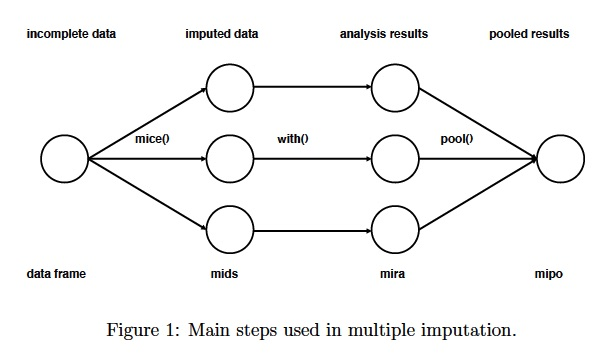

```{r setup, include=FALSE}
knitr::opts_chunk$set(echo=T, message=FALSE, warning=FALSE, knitr.purl.inline = TRUE )
```

```{=html}
<style>
body {
  text-align: justify;
}
</style>
```

## Intro

When dealing with missing data, researchers often rely on two common approaches that are easy to implement.

-   **Listwise-deletion** (also called Complete Case Analysis): This method involves deleting rows in your dataset that contain missing data (such as NAs, NaN, etc.). If the amount of missing data is very small, this might be the most straightforward approach to ensure your analysis is not biased. However, there are drawbacks:

    -   Deleting data points can lead to the loss of valuable information, especially if the dataset is small
    -   It reduces the degrees of freedom in statistical analysis (which is not a problem in large samples)
    -   It may result in discarding valid data points simply because one column value is missing

For example, we have four variables (columns) and seven cases (rows). Some rows have missing values in one variable, while others have missing values in two:

| ID  | Var1 | Var2 | Var3 | Var4 |
|-----|------|------|------|------|
| 1   | 12   | 5.4  | NA   | 8.2  |
| 2   | NA   | 7.1  | 3.2  | 9.4  |
| 3   | 15   | NA   | 4.5  | 6.8  |
| 4   | 8    | 4.2  | 2.3  | NA   |
| 5   | 10   | 6.3  | NA   | 7.1  |
| 6   | NA   | 5.9  | 3.8  | NA   |
| 7   | 14   | 8.1  | 5.7  | 9.2  |

If we include all four variables in the analysis, any row with one or more NA values will be excluded. As a result, we would end up with only N=1.

| ID    | Var1   | Var2    | Var3    | Var4    |
|-------|--------|---------|---------|---------|
| ~~1~~ | ~~12~~ | ~~5.4~~ | ~~NA~~  | ~~8.2~~ |
| ~~2~~ | ~~NA~~ | ~~7.1~~ | ~~3.2~~ | ~~9.4~~ |
| ~~3~~ | ~~15~~ | ~~NA~~  | ~~4.5~~ | ~~6.8~~ |
| ~~4~~ | ~~8~~  | ~~4.2~~ | ~~2.3~~ | ~~NA~~  |
| ~~5~~ | ~~10~~ | ~~6.3~~ | ~~NA~~  | ~~7.1~~ |
| ~~6~~ | ~~NA~~ | ~~5.9~~ | ~~3.8~~ | ~~NA~~  |
| 7     | 14     | 8.1     | 5.7     | 9.2     |

-   **Mean/median substitution**: another quick fix is to take the mean/median of the existing data points and substitute missing data points with the mean/median. While it doesn’t change the mean of the dataset, it could cause bias in the analysis since it decreases variance (if you have a lot of missing data and you are replacing them with a fixed number).

Despite their apparent simplicity and widespread use, these approaches entail substantial limitations that can introduce bias and weaken the robustness of quantitative analyses.

## Multiple imputation

Multiple imputation requires more work than the previous two options. With this approach, rather than replacing missing values with a single value, **we use the distribution of the observed data/variables to estimate multiple possible values for the data points**. This allows us to account for the uncertainty around the true value, and obtain approximately unbiased estimates (under certain conditions).

Rubin (1976) proposed a **five-step procedure to impute the missing data**:

1.  Impute the missing values using an appropriate model (logistical regression, categorical regression, etc)
2.  Repeat the imputation process 3-5 times (usually 10-15).
3.  Perform the desired analysis on each imputed dataset using standard methods for complete data.
4.  Average the parameter estimates across the imputed datasets to obtain a single point estimate.
5.  Calculate standard errors by averaging the squared standard errors of the estimates from the imputed datasets.

Within CRAN, there are a number of packages associated with Multiple Imputation.

### Assumptions for multiple imputation: types of missing data

In 1976, Rubin classified types of missing data into three categories: MCAR, MAR, and MNAR.

-   **MCAR = Missing Completely at Random**: Data are missing completely at random when the probability of a value being missing is unrelated to any data, whether observed or unobserved. For example, if some questionnaires are lost purely by chance, every participant had the same probability of being affected. **This is the ideal case.**

-   **MAR = Missing at Random**: Data are missing at random when the probability of missingness depends only on observed data, not on the missing value itself. For example, if younger respondents are less likely to report their income, the missing income values can be estimated using other observed characteristics such as age, education, or employment status.

-   **MNAR = Missing Not at Random**: Data are missing not at random when the probability of missingness depends on the unobserved value itself or on unmeasured factors. For example, individuals with very high or very low incomes may choose not to report their income specifically because of its value, and this cannot be fully explained by the observed data.

Although MCAR is the most desirable situation, it is rarely realistic in real data. For this reason, multiple imputation methods usually rely on the less restrictive MAR assumption. Under MAR, missing values can be estimated using the observed data, which makes statistical modeling possible.

## Example of data imputation

```{r, include=FALSE}
library(ggplot2)
library(readr)
library(dplyr)
library(cowplot)
library(explore)
library(titanic)
library(patchwork)
library(ggplot2)
library(tidyr)
```

Read the data set *titanic_train.csv*

```{r}
titanic <- as_tibble(titanic_train)
titanic |> describe_tbl()
titanic |> describe()
```

Age is the only continuous variable containing missing data. Although categorical variables can also be imputed using appropriate models, the process depends on their structure. For example, `Pclass` has only a small number of categories and could therefore be imputed using a multinomial logistic model. In contrast, `Cabin` contains a large number of distinct values, which may result in unstable or less reliable imputations.

Let’s examine the distribution of the variable `Age`.

```{r}
ggplot(titanic, aes(Age)) +
  geom_histogram(binwidth = 1,   color = "skyblue3", fill = "skyblue") +
  ggtitle("Distribution of the Age variable") +
  theme_classic() +
  theme(plot.title = element_text(size = 18))

```

### Simple value imputation

One common approach to handling missing data involves replacing missing values with a single summary statistic/value. For example:

-   Constant imputation: Zero or another specified value
-   Mean: Average age after all NA's are removed.
-   Median: Median age after all NA's are removed

```{r}
cvalue_imputation <- titanic |>
  mutate(
    original = Age,
    imputed_zero = if_else(is.na(Age), 0, Age),
    imputed_mean = if_else(is.na(Age), mean(Age, na.rm = TRUE), Age),
    imputed_median = if_else(is.na(Age), median(Age, na.rm = TRUE), Age)
  ) 

head(cvalue_imputation[, c("original", 
                          "imputed_zero", 
                          "imputed_mean", 
                          "imputed_median")], 10)
```

Once the data has been imputed, let's compare the distributions of the four variables

```{r}
# Define variables and colors
variables <- c("original", "imputed_zero", "imputed_mean", "imputed_median")
titles <- c("Original Age Distribution", "Zero Imputation", "Mean Imputation", "Median Imputation")
colors <- c("skyblue3", "#15ad4f", "#6a6ad9", "#e65100")

# Pivot data
value_imputation_long <- cvalue_imputation %>%
  pivot_longer(all_of(variables), names_to = "method", values_to = "value")

# Create plots
plots <- value_imputation_long %>%
  mutate(title = factor(method, levels = variables, labels = titles)) %>%
  ggplot(aes(x = value, fill = title)) +
  geom_histogram(binwidth = 1, color = "#808080") +
  facet_wrap(~title, scales = "free_y") +
  scale_fill_manual(values = colors) +
  theme_classic() +
  theme(legend.position = "none")

print(plots)

```

Imputing missing values with a single constant, such as the mean or median, can distort the distribution of the data. Although these statistics provide a useful summary, using them to replace missing values may lead to an inaccurate distribution, particularly when the proportion of missing data is large. Using a single value such as zero is especially problematic. For instance, it is highly unlikely that around 200 passengers in a dataset would all be aged zero, which highlights the inadequacy of zero imputation.

\*\* if you have missing data in the dependent variable, you need to remove these variables \*\*

### Multiple imputation with MICE

[MICE](https://search.r-project.org/CRAN/refmans/mice/html/mice.html) stands for Multivariate Imputation by Chained Equations. It is a widely used package among R users for handling missing data. It operates under the assumption that missing values occur at random (MAR), implying that the likelihood of a value being missing is determined by observable data, allowing for predictions based on those observed values. It's important to note, as previously mentioned, that the assumption of missing completely at random (MCAR) is often unrealistic in practical scenarios.

The basic idea behind the algorithm is to treat each variable that has missing values as a dependent variable in regression and treat the others as independent (predictors). In the reference section you can find documentation and papers using MICE for MI.

By default, the `mice` package uses the following methods:

-   PMM (Predictive Mean Matching) → numeric variables
-   logreg (Logistic regression) → binary variables with exactly 2 levels
-   polyreg (Bayesian polytomous regression) → unordered factor variables with more than 2 levels
-   polr (Proportional odds model) → ordered factor variables with more than 2 levels

However, the `mice` package offers many other alternatives. Check [here](https://www.rdocumentation.org/packages/mice/versions/3.14.0/topics/mice).

After completing the imputation process, multiple datasets are generated that differ only in their imputed values. It is generally recommended to analyze each dataset separately and then pool the results.



Let's delve into the practical application. To keep things simple, we focus on Age as the variable to be imputed, together with Survived, Pclass, SibSp, and Parch:

-   Survived indicates whether the passenger survived the disaster (1 = survived, 0 = did not survive).
-   Pclass refers to the passenger’s ticket class (1 = first class, 2 = second class, 3 = third class). It reflects socioeconomic status.
-   SibSp SibSp measures horizontal family relationships, such as siblings and spouses.
-   Parch measures vertical family relationships, such as parents and children.

```{r}
library(mice)
titanic_numeric <- titanic |>
  select(Survived, Pclass, SibSp, Parch, Age)
```

Function \`md.pattern()´ helps to understand the pattern of missing data. It returns a tabular form of missing value present in each variable in a data set.

```{r}
md.pattern(titanic_numeric) 
```

The main functions of MICE are:

-   `mice()`: Impute the missing data *m* times
-   `with()`: Analyze completed data sets
-   `pool()`: Combine parameter estimates
-   `complete()`: Export imputed data
-   `ampute()`: Generate missing data

Moving on to the imputation process, we will employ the following MICE imputation methods:

-   **pmm (Predictive Mean Matching)**: Replaces missing values with observed values from similar cases. It preserves realistic data and avoids artificial numbers.

-   **cart (Classification and Regression Trees)**: Uses decision trees to predict missing values based on patterns in the data. It can capture non-linear relationships.

-   **lasso.norm (Lasso linear regression)**: Uses penalized linear regression to predict missing numeric values, automatically selecting the most important predictors.

```{r results='hold'}
library(mice)
mice_imputed <- data.frame(
  original = titanic$Age,
  imputed_pmm = complete(mice(titanic_numeric, m=5, method = "pmm", seed=123))$Age,
  imputed_cart = complete(mice(titanic_numeric, m=5, method = "cart", seed=123))$Age,
  imputed_lasso = complete(mice(titanic_numeric, m=5, method = "lasso.norm", seed=123))$Age
)
```

imp is the number of imputations set by m=5.

A couple of notes on the parameters:

-   `m=...` refers to the number of imputed datasets. Five is the default value.
-   `meth='...'` refers to the imputation method. Remember that other imputation methods can be used
-   `complete` extracts the complete dataset after imputation to perform statistical analysis on it

```{r}
head(mice_imputed, 10)
```

Let's plot the results:

```{r}
# Define variables, titles, and colors
variables <- c("original", "imputed_pmm", "imputed_cart", "imputed_lasso")
titles <- c("Distribution of the Age variable", "PMM-imputed distribution", "Cart-imputed distribution", "Lasso-imputed distribution")
colors_fill <- c("skyblue", "#15ad4f", "#6a6ad9", "#e65100")
colors_border <- c("skyblue3", "#808080", "#808080", "#808080")

# Pivot data
mice_imputed_long <- mice_imputed %>%
  pivot_longer(all_of(variables), names_to = "method", values_to = "value")

# Create plots
plots <- mice_imputed_long %>%
  mutate(title = factor(method, levels = variables, labels = titles)) %>%
  ggplot(aes(x = value, fill = title)) +
  geom_histogram(binwidth = 1, color = "#808080", position = "identity") +
  facet_wrap(~title, scales = "free_y") +
  scale_fill_manual(values = colors_fill) +
  theme_classic() +
  theme(legend.position = "none")

print(plots)

```

Remember that you can try any algorithm from [this list](https://www.rdocumentation.org/packages/mice/versions/3.14.0/topics/mice).

### Multiple imputation with Miss Random Forest

The [Miss Forest](https://cran.r-project.org/web/packages/missForest/missForest.pdf) imputation technique is based on the Random Forest algorithm. As a non-parametric method, it does not rely on explicit distributional assumptions about the data. Instead, it estimates missing values by learning complex patterns and relationships within the dataset.

In practice, MissForest builds a random forest model for each variable with missing values and iteratively predicts the missing entries using the other variables as predictors. This procedure continues until the imputations stabilize. The method is flexible and can handle both numerical and categorical data, making it particularly useful for complex datasets where traditional parametric imputation methods may perform poorly.

To demonstrate the application of MissForest in R, we apply the technique to a numerical dataset, focusing specifically on imputing missing values in the `Age` variable.

```{r}
#install.packages("missForest")
library(missForest)
missForest_imputed <- data.frame(
  original = titanic_numeric$Age,
  imputed_missForest = missForest(as.data.frame(titanic_numeric), ntree = 15)$ximp$Age)
```

Let's check the resulting data.frame:

```{r}
head(missForest_imputed, 10)
```

Finally, let’s visualize the distributions:

```{r}
# Define variables, titles, and colors 
variables <- c("original", "imputed_missForest")
titles <- c("Distribution of the Age variable", "Miss Forest-imputed distribution")
colors_fill <- c("skyblue", "#FFD700") # Fill colors for the histograms
colors_border <- c("skyblue3", "#808080") # Border colors for the histograms

# Pivot data
missForest_imputed_long <- missForest_imputed %>%
  pivot_longer(all_of(variables), names_to = "method", values_to = "value")

# Create plots
plots <- missForest_imputed_long %>%
  mutate(title = factor(method, levels = variables, labels = titles)) %>%
  ggplot(aes(x = value, fill = title)) +
  geom_histogram(binwidth = 1, color = "#808080", position = "identity") +
  facet_wrap(~title, scales = "free_y") +
  scale_fill_manual(values = colors_fill) +
  theme_classic() +
  theme(legend.position = "none")

print(plots)

```

The observed distribution significantly deviates from the original, with a notable concentration of values around age 35. This indicates that the Miss Forest imputation technique may not be the most suitable option for this particular scenario.

### Multiple imputation with Amelia

Amelia II performs multiple imputation for cross-sectional data (such as surveys), time-series data (for example, yearly observations for one country), and time-series cross-sectional data (such as yearly data for multiple countries). It uses a bootstrapping-based algorithm known as EMB (Expectation-Maximization with Bootstrapping). More information is available [here](https://gking.harvard.edu/amelia).

How it works:

1.  Amelia draws *m* bootstrap samples from the original data.\
2.  For each bootstrap sample, it applies the EM algorithm to estimate the parameters of the data distribution.\
3.  These parameter estimates are then used to generate imputed values, producing *m* completed datasets.

Amelia II is particularly useful for multiple imputation in time-series and time-series cross-sectional data, where temporal structure can be incorporated into the imputation process. For an applied example, see the vignette using data from Milner and Kubota (2005) on democracy and trade policy [here](https://cran.r-project.org/web/packages/Amelia/vignettes/using-amelia.html).

## Runing regressions with MICE

Let us assume that the goal of our analysis is to apply a generalized linear model (GLM) to estimate the probability of survival from the shipwreck. We will use the "cart" method, which we have identified as the most suitable approach.

The literature presents an ongoing debate about whether the dependent variable should be imputed. While it is generally accepted that the outcome variable should be included in the imputation model when imputing missing covariate values, [it is not clear whether the outcome itself should be imputed](https://bmcmedresmethodol.biomedcentral.com/articles/10.1186/s12874-016-0281-5). According to the literature, both approaches have advantages and disadvantages.

In our example, we will use the variable `Survived` to help impute missing values in `Age`, but we will not impute missing values in the outcome variable itself.

Prepare data for MI

```{r}
init = mice(titanic_numeric)
meth = init$method
```

This code runs an initial mice() procedure to generate the default imputation setup for the dataset. It then extracts the automatically assigned imputation methods for each variable and stores them in meth so they can be inspected or modified.

Next, we specify the method used to impute missing values. Here, we set the imputation method for `Age` to `"cart"`. Variables not specified in this vector will not be imputed.

```{r}
meth[c("Age")]="cart"

```

Now we're going to include the imputation formula. The argument m = 5 means that five imputed datasets are generated. This is the default value in mice, so it is not strictly necessary to specify it. Setting a seed ensures that the results are reproducible.

```{r}
imputed_cart <- mice(titanic_numeric, method=meth, m=5, seed=123)
summary(imputed_cart)
```

To inspect the imputed values, run the following line of code. This will display only the imputed values for `Age` across the five imputed datasets.

```{r}
head(imputed_cart$imp$Age, 5)  
```

We can retrieve a completed dataset using the `complete()` function. This replaces the missing values with the imputed values from one of the imputed datasets. By default, specifying `1` selects the first imputed dataset.

```{r}
completed_imputed_1 <- complete(imputed_cart, 1)   # First imputed dataset
head(completed_imputed_1, 7)
```

If you wish to extract all imputed datasets, you can use `"all"`

```{r}
completed_imputed <- complete(imputed_cart, "all") # List of 5 imputed datasets
```

The final step is to estimate a generalized linear model (GLM) to model survival probability. A common question in multiple imputation is which completed dataset should be used for the analysis. Rather than selecting one arbitrarily, the `mice` package allows us to fit the model separately to each imputed dataset and then combine the estimates using `pool()`.

First, we fit the model to the original data containing missing values (listwise deletion):

```{r}
model0 <- glm(Survived ~ Pclass + SibSp + Parch + Age, data = titanic_numeric)
summary(model0)
```

Next, we fit the same model across the five imputed datasets:

```{r}
model1 <- with(imputed_cart, glm(Survived ~ Pclass + SibSp + Parch + Age))
summary(pool(model1))
```

The object `model1` stores the regression results from each imputed dataset. The pool() function then combines these estimates following [Rubin’s rules](https://www.rdocumentation.org/packages/mice/versions/3.6.0/topics/pool), producing a single set of coefficients and standard errors that account for imputation uncertainty.

Based on the pooled results, all variables in the model appear to be statistically significant. They may look similar if the proportion of missing data is small, but multiple imputation accounts for uncertainty due to missingness, whereas listwise deletion simply removes incomplete cases.

## References

About missing data and inference:

-   [Rubin, Donald B. 1976. “Inference and missing data.” Biometrika 63, no. 3: 581-592](Rubin,%20Donald%20B.%201976.%20“Inference%20and%20Missing%20Data.”%20Biometrika%2063%20(3):%20581–92.%20http://www.jstor.org/stable/2335739)

About the *mice* method approach:

-   https://www.rdocumentation.org/packages/mice/versions/3.14.0/topics/mice

-   https://www.jstatsoft.org/article/view/v045i03

About the *missForest* method

-   https://academic.oup.com/bioinformatics/article/28/1/112/219101?login=false

Missing values on time series:

-   James Honaker and Gary King, "What to do About Missing Values in Time Series Cross-Section Data" American Journal of Political Science Vol. 54, No. 2 (April, 2010): Pp. 561-581.

-   Matthew Blackwell, James Honaker, and Gary King. A Unified Approach to Measurement Error and Missing Data: Overview and Details And Extensions both in Sociological Methods and Research, forthcoming.

On whether or not the DV is to be imputed

-   Kontopantelis, E., White, I. R., Sperrin, M., & Buchan, I. (2017). Outcome-sensitive multiple imputation: A simulation study. BMC Medical Research Methodology, 17(1). https://doi.org/10.1186/s12874-016-0281-5
