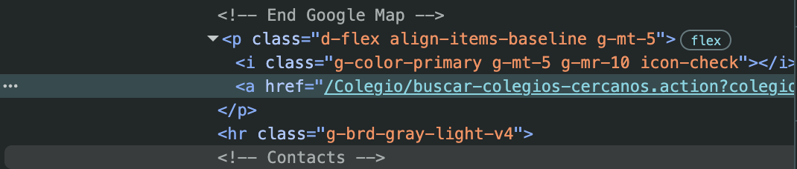
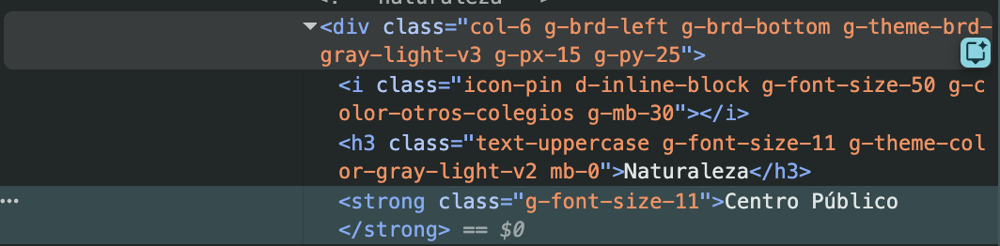
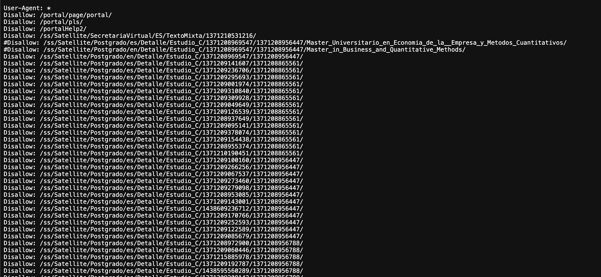

```{r}
library(xml2)
library(httr)
library(tidyverse)
library(sf)
library(rnaturalearth)
library(scrapex)
```

Copy the URL from school 13 of 27.

```{r}
school_links <- spanish_schools_ex()

# Keep only the HTML file of one particular school.
school_url <- school_links[13]

school_url
```

```{r}
# code to see school URL
# browseURL(prep_browser(school_url))
```

Read the HTML copy and save it in a variable

```{r}
school_raw <- read_html(school_url) |> xml_child()
school_raw
```

We want to scrape the school locations. We need to figure out the level in which the element is located. We need the latitude and longitude in order to build a map.

Inspect the element to discover where it is in the code. It is in an "a" tag that is housed within a "p" tag with a class of "d-flex align-items-baseline g-mt-5".



```{r}
# Search for all <p> tags with that class in the document
school_raw |>
  xml_find_all("//p[@class='d-flex align-items-baseline g-mt-5']")
```

We are searching for all elements with type "p" that have the classes listed above. Only one returns.

```{r}
location_str <-
  school_raw |>
  xml_find_all("//p[@class='d-flex align-items-baseline g-mt-5']//a") |>
  xml_attr(attr = "href")

location_str
```

We then extract the href tag using xml_attr.

We need to clean up the data. We can do it one step at a time.

The data is structured as latitud= . longitud=

```{r}
location <-
  location_str |>
  str_extract_all("=.+$")

location
```

Using `"=.+$"` we capture a `=` followed by any character (the `.`) repeated 1 or more times (`+`) until the end of the string (`$`). In layman terms: extract any text after the `=` until the end of the string.

We now have both the latitude and longitude coordinates. How do we clean up the data?

```{r}
# removes the noise in the middle
location <-
  location |>
  str_replace_all("=|colegio\\.longitud", "")

location
```

Use the ampersand to separate the latitude and longitude.

```{r}
location <-
  location %>%
  str_split("&") %>%
  .[[1]]

location
```

Now we have a variable location with two strings. We need to convert it to a dataframe with location 1 as latitude and location 2 as longitude. We will do that when we scale it to all schools.

```{r}
# This sets your `User-Agent` globally so that all requests are identified with this `User-Agent`
set_config(
  user_agent("Mozilla/5.0 (Macintosh; Intel Mac OS X 10_15_7) AppleWebKit/537.36 (KHTML, like Gecko) Chrome/144.0.0.0 Safari/537.36; Amelia Shuler / amelia.b.shuler@gmail.com")
)

# Collapse all of the code from above into one function called
# school grabber

school_grabber <- function(school_url) {
  # We add a time sleep of 5 seconds to avoid
  # sending too many quick requests to the website
  Sys.sleep(3)

  school_raw <- read_html(school_url) %>% xml_child()

  location_str <-
    school_raw %>%
    xml_find_all("//p[@class='d-flex align-items-baseline g-mt-5']//a") %>%
    xml_attr(attr = "href")

  location <-
    location_str %>%
    str_extract_all("=.+$") %>%
    str_replace_all("=|colegio\\.longitud", "") %>%
    str_split("&") %>%
    .[[1]]

  # Turn into a data frame
  data.frame(
    latitude = location[1],
    longitude = location[2],
    stringsAsFactors = FALSE
  )
}

school_grabber(school_url)
```

This code works for a single school. Let's see it on all schools.

```{r}
coordinates <- map_dfr(school_links, school_grabber)
coordinates
```

So now that we have the coordinates for all schools, let's plot them.

```{r}
coordinates <- mutate_all(coordinates, as.numeric)

sp_sf <-
  ne_countries(scale = "large", country = "Spain", returnclass = "sf") %>%
  st_transform(crs = 4326)

ggplot(sp_sf) +
  geom_sf() +
  geom_point(data = coordinates, aes(x = longitude, y = latitude)) +
  coord_sf(xlim = c(-20, 10), ylim = c(25, 45)) +
  theme_minimal() +
  ggtitle("Sample of schools in Spain")
```

If your map is not working, run the code below:

```{r}
# install.packages("pak")
# pak::pkg_install("ropensci/rnaturalearthhires")
```

## Scraping public / private data

Now we will scrape the information of whether the school is public or private.



The item is within a div with a long class that we will use to identify the strong tag.

```{r}
school_raw |>
  xml_find_all("//div[@class='col-6 g-brd-left g-brd-bottom g-theme-brd-gray-light-v3 g-px-15 g-py-25']")
```

We got 10 because the div is the 10 boxes on the screen. Let's combine it with the strong tag to narrow further.

```{r}
text_boxes <-
  school_raw %>%
  xml_find_all("//div[@class='col-6 g-brd-left g-brd-bottom g-theme-brd-gray-light-v3 g-px-15 g-py-25']//strong") %>%
  xml_text()

text_boxes
```

School type is in slot 7, so let's extract that.

```{r}
single_public_private <-
  text_boxes %>%
  str_detect("Centro") %>%
  text_boxes[.]

single_public_private
```

We now have everything we need to extract the information as to whether the school is private or public.

```{r}
grab_public_private_school <- function(school_link) {
  Sys.sleep(3)
  school <- read_html(school_link)
  text_boxes <-
    school %>%
    xml_find_all("//div[@class='col-6 g-brd-left g-brd-bottom g-theme-brd-gray-light-v3 g-px-15 g-py-25']//strong") %>%
    xml_text()

  single_public_private <-
    text_boxes %>%
    str_detect("Centro") %>%
    text_boxes[.]


  data.frame(
    public_private = single_public_private,
    stringsAsFactors = FALSE
  )
}

public_private_schools <- map_dfr(school_links, grab_public_private_school)
public_private_schools
```

We can then merge this information with the graph information.

```{r}
# Let's translate the public/private names from Spanish to English
lookup <- c("Centro Público" = "Public", "Centro Privado" = "Private")
public_private_schools$public_private <- lookup[public_private_schools$public_private]

# Merge it with the coordinates data
all_schools <- cbind(coordinates, public_private_schools)

# Plot private/public by coordinates
ggplot(sp_sf) +
  geom_sf() +
  geom_point(data = all_schools, aes(x = longitude, y = latitude, color = public_private)) +
  coord_sf(xlim = c(-20, 10), ylim = c(25, 45)) +
  theme_minimal() +
  ggtitle("Sample of schools in Spain by private/public")
```

## **Extracting type of school**

We want to extract the type of school, which is right next to the whether the school is public or private. We can't reuse the same code as before because we searched on the regex "centro" (which comes before "privado" or "público"). We will need to instead search on the title of the box.

This is the same as before:

```{r}
text_boxes <-
  school_raw %>%
  xml_find_all("//div[@class='col-6 g-brd-left g-brd-bottom g-theme-brd-gray-light-v3 g-px-15 g-py-25']")

text_boxes
```

We then use the regex "Tipo Centro" since that is the name of the box.

```{r}
selected_node <- text_boxes %>% xml_text() %>% str_detect("Tipo Centro")
selected_node
```

The 7th node is the one we are looking for.

```{r}
single_type_school <-
  text_boxes[selected_node] %>%
  xml_find_all(".//strong") %>%
  xml_text()

single_type_school
```

Now let's make the function to run.

```{r}
grab_type_school <- function(school_link) {
  Sys.sleep(3)
  school <- read_html(school_link)

  text_boxes <-
    school %>%
    xml_find_all("//div[@class='col-6 g-brd-left g-brd-bottom g-theme-brd-gray-light-v3 g-px-15 g-py-25']")

  selected_node <-
    text_boxes %>%
    xml_text() %>%
    str_detect("Tipo Centro")

  single_type_school <-
    text_boxes[selected_node] %>%
    xml_find_all(".//strong") %>%
    xml_text()


  data.frame(
    type_school = single_type_school,
    stringsAsFactors = FALSE
  )
}

all_type_schools <- map_dfr(school_links, grab_type_school)
all_type_schools
```

Let's merge it with the other extracted data on the map.

```{r}
all_schools <- cbind(all_schools, all_type_schools)

ggplot(sp_sf) +
  geom_sf() +
  geom_point(data = all_schools, aes(x = longitude, y = latitude, color = public_private)) +
  coord_sf(xlim = c(-20, 10), ylim = c(25, 45)) +
  facet_wrap(~ type_school) +
  theme_minimal() +
  ggtitle("Sample of schools in Spain")
```

## Ethical Issues with Web Scraping

We are collecting information that is not our information.

### Terms of Service

It might be contrary to terms of service of the website. Facebook TOS does not allow bots. The robots.txt file will be included in many sites and tell you how to behave. [For example.](https://uc3m.es/robots.txt)



Asterisk (\*) means any user ID can access this.

The listed websites are not allowed to be scraped.

[Here](https://www.marca.com/robots.txt), specific users are blocked for all sites with `Disallow: /`

### Overloading the Server

It also involves cluttering the server of a website. Taking 5 seconds for school (I changed this to 3) means we aren't overwhelming the site. Sometimes robotstxt file will tell you how many seconds you should wait. Multiplying the total number of websites we'll scrape by the number of seconds you'll sleep will give you the total time the project will take.
