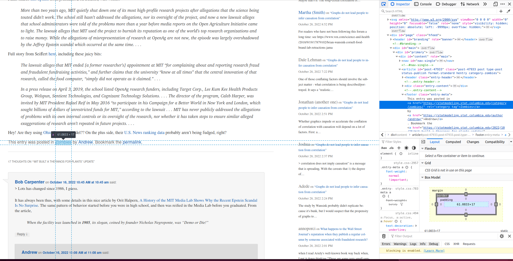

Javascript allows dynamic elements on the page. It also makes scraping the website difficult since it is not available in the code directly. If we download a copy of the website, we cannot access these elements.

We are going to use `RSelenium` that allows the bot to behave like a human and click on elements.

```{r}
library(RSelenium)
library(scrapex)
library(xml2)
library(magrittr)
library(lubridate)
library(dplyr)
library(tidyr)
```

## Using Selenium to Open a Browser

Selenium opens a browser and clicks on parts of the pages as if it was human. After this, use `xml2` to extract the data needed.

```{r}
blog_link <- gelman_blog_ex()
```

Save the blog link.

```{r}
remDr <- rsDriver(browser = "firefox", phantomver = NULL, port = 3434L)
```

This opens an empty browser.

```{r}
remDr$client$navigate(prep_browser(blog_link))
```

This opens the blog link.

## Using Selenium to Click on Something

The most effective way to navigate in `RSelenium` is to use XPath to find parts of the website that you want perform an action and then use some of the methods to click, send or submit something on the website.

```{r}
blog_link |>
  read_html() |>
  xml_find_all("(//h1[@class='entry-title']//a)[1]")
```

`read_html()` downloads the HTML source code. `xml_find_all` finds all a links within h1 tags with the class "entry-title". This saves the link, but does not click on it. We need to use Selenium to click on it.

```{r}
# Since we'll use the client a lot let's save it on a separate object
driver <- remDr$client
driver$findElement(value = "(//h1[@class='entry-title']//a)[1]")$clickElement()
```

This code clicks on the element selected. `findElement()` finds the element and `clickElement()` clicks it.

## Extract the HTML Code

To extract the HTML code and extract information we need to use getPageSource() and extract the appropriate slot.

```{r}
page_source <- driver$getPageSource()[[1]]
```

`page_source` is a string that contains all the HTML source code of the website. We can then use `read_html()` to read it.

```{r}
html_code <-
  page_source |>
  read_html()
```

## Finding Specific Information

Let’s assume we want to find all categories that are associated with this post. The categories are in the bottom of the post:



```{r}
categories_first_post <-
  html_code %>%
  xml_find_all("//footer[@class='entry-meta']//a[contains(@href, 'category')]") %>%
  xml_text()

categories_first_post
```

This extracts all categories of the post. Let's extract the date.

```{r}
entry_date <-
  html_code |>
  xml_find_all("//time[@class='entry-date']") |>
  xml_text() |>
  parse_date_time("%B %d, %Y %I:%M %p")

entry_date
```

Note of the use of `parse_date_time` and the time format (all the `%` symbols) to convert the string of date/time into R. With that information we can create a clean data frame of entry dates with their respective categories in a list column:

```{r}
final_res <- tibble(entry_date = entry_date, categories = list(categories_first_post))
final_res
```

## Making a Loop

With this code, let's say we want to loop it over each blog post. We need Selenium to go back to the main page of the blog between extractions. Use `goBack()` to do this.

```{r}
driver$goBack()
```

Now let's make the loop:

```{r}
collect_categories <- function(page_source) {
  # Read source code of blog post
  html_code <-
    page_source |>
    read_html()
  
  # Extract categories
  categories_first_post <-
    html_code |>
    xml_find_all("//footer[@class='entry-meta']//a[contains(@href, 'category')]") |>
    xml_text()
  
  # Extract entry date
  entry_date <-
    html_code |>
    xml_find_all("//time[@class='entry-date']") |>
    xml_text() |>
    parse_date_time("%B %d, %Y %I:%M %p")
  
  # Collect everything in a data frame
  final_res <- tibble(entry_date = entry_date, categories = list(categories_first_post))
    final_res
}

# Get all number of blog posts on this page
num_blogs <-
  blog_link |>
  read_html() |>
  xml_find_all("//h1[@class='entry-title']//a") |>
  length()

blog_posts <- list()

# Loop over each post, extract the categories and go back to the main page
for (i in seq_len(num_blogs)) {
  print(i)
  # Go to the next blog post
  xpath <- paste0("(//h1[@class='entry-title']//a)[", i, "]")
  Sys.sleep(2)
  driver$findElement(value = xpath)$clickElement()

  # Get the source code
  page_source <- driver$getPageSource()[[1]]

  # Grab all categories
  blog_posts[[i]] <- collect_categories(page_source)

  # Go back to the main page before next iteration
  driver$goBack()
}
```

While your code runs, open the browser and enjoy the show. Your browser will start working it self as if a ghost were scrolling down and clicking on each blog post. When it finishes, we’ll have a list of all categories in the last 20 blog posts. Let’s combine those and get a count of the most used categories:

```{r}
combined_df <- bind_rows(blog_posts)

combined_df |>
  unnest(categories) |>
  count(categories) |>
  arrange(-n)
```

This should have a tibble with the data for categories, but it isn't working.

## Other Functions

Selenium can also fill out forms. These are some of the methods available:

-   driver\$Navigate("http://somewhere.com/")

-   driver\$goBack()

-   driver\$goForward()

-   driver\$refresh()

-   driver\$getTitle()

-   driver\$getCurrentUrl()

-   driver\$getStatus()

-   driver\$screenshot(display = TRUE)

-   driver\$getAllCookies()

-   driver\$deleteCookieNamed("PREF")

-   driver\$switchToFrame("string\|number\|null\|WebElement")

-   driver\$getWindowHandles()

-   driver\$getCurrentWindowHandle()

-   driver\$switchToWindow("windowId")

You can do all sorts of things like taking a screenshot of the website, grabbing the URL, delete cookies and so much more.

## Filling out forms

```{r}
driver$findElement(value = "(//h1[@class='entry-title']//a)[1]")$clickElement()
```
