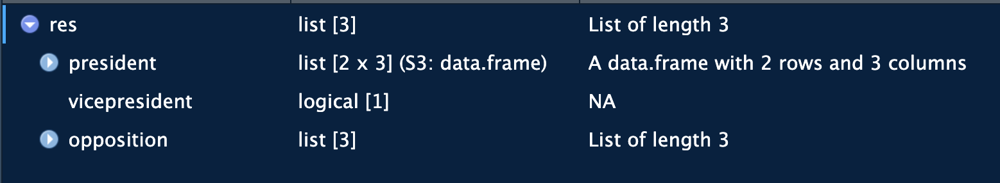
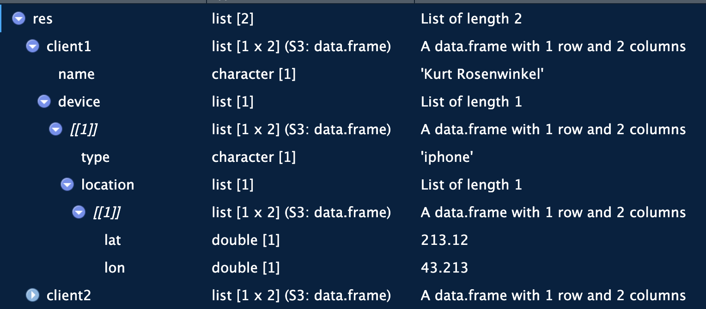

```{r}
library(jsonlite)
library(tibble)
library(tidyr)
```

-   most APIs will return data in Javascript Object Notation (JSON)

-   the format is designed to share data over the internet

-   it is text-based: it can be opened with any code editor and nearly all programming languages

-   it supports numeric/string values and arrays

-   it has nested relationships in a way that is easy to read

#### How to save JSON information

JSON is stored as key:value pairs.

```{r}
json_str <- '{
  "president": "Parlosi",
  "vicepresident": "Kantos",
  "opposition": "Pitaso"
}'

fromJSON(json_str)
```

#### What do we do if the information is nested?

JSON stores the information in arrays. An array is a collection of elements of the same data type, used to store multiple values under a single variable name.

```{r}
json_str <- '
{
    "president": [
        {
            "last_name": "Parlosi",
            "party": "Free thinkers",
            "age": 35
        }
    ],
    "vicepresident": [
        {
            "last_name": "Kantos",
            "party": "Free thinkers",
            "age": 52
        }
    ],
    "opposition": [
        {
            "last_name": "Pitaso",
            "party": "Everyone United",
            "age": 45
        }
    ]
}
'

fromJSON(json_str, simplifyDataFrame = TRUE)
```

The information is printed as three separate tables.

```{r}
json_str <- '
{
    "president": [
        {
            "last_name": "Parlosi",
            "party": "Free thinkers",
            "age": 35
        },
        {
            "last_name": "Stevensson",
            "party": "Free thinkers"
        }
    ],
    "vicepresident": [
        null
    ],
    "opposition": {
        "last_name": "Pitaso",
        "party": "Everyone United",
        "age": 45
    }
}
'

res <- fromJSON(json_str)
```

Here, we get the following result:



A dataframe, an NA slot, and a named list.

The ideal summary of the result is everything in a single dataframe with complete and incomplete information. Each category is a row.

We can use `enframe()` and `unnest()` to achieve this.

```{r}
res$opposition <- data.frame(res$opposition)
res |>
  enframe() |>
  unnest(cols = value)
```

`unnest()` will not work if the objects are different classes (data.frame, vectors, lists, etc). If all objects are the same, it will combine them into a proper column. Convert opposition first.

#### Super Complicated Example

```{r}
json_str <- '
{
    "client1": [
        {
            "name": "Kurt Rosenwinkel",
            "device": [
                {
                    "type": "iphone",
                    "location": [
                        {
                            "lat": 213.12,
                            "lon": 43.213
                        }
                    ]
                }
            ]
        }
    ],
    "client2": [
        {
            "name": "YEITUEI",
            "device": [
                {
                    "type": "android",
                    "location": [
                        {
                            "lat": 211.12,
                            "lon": 53.213
                        }
                    ]
                }
            ]
        }
    ]
}
'

res <- fromJSON(json_str)
res
```

The clients are split into two dataframes. The dataframes have the same structure.



The information is saved as lists within lists. Ways to access them:

```{r}
# access the client
res$client1

# access the device
res$client1$device[[1]]

# access the device location
res$client1$device[[1]]$location[[1]]
```

To unnest these things:

```{r}
all_res <- res |>
  enframe(name = "client") |>
  unnest(cols = "value") |>
  unnest(cols = "device") |>
  unnest(cols = "location")
all_res
```
