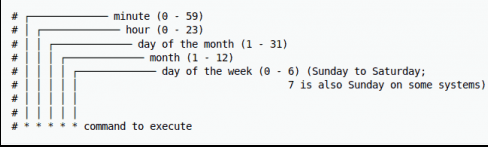

```{r}
library(scrapex)
library(xml2)
library(magrittr)
library(purrr)
library(tibble)
library(tidyr)
library(readr)
```

This chapter will focus on scheduling scripts for Linux and MacOS. We will be learning to automate scrapers for web scraping and APIs.

## Automating Web Scrapers

```{r}
# If this were being done on the real website of the newspaper, you'd want to
# replace the line below with the real link of the website.
newspaper_link <- elpais_newspaper_ex()
newspaper <- read_html(newspaper_link)

all_sections <-
  newspaper %>%
  # Find all <section> tags which have an <article> tag
  # below each <section> tag. Keep only the <article>
  # tags which an attribute @data-dtm-region.
  xml_find_all("//section[.//article][@data-dtm-region]")

final_df <-
  all_sections %>%
  # Count the number of articles for each section
  map(~ length(xml_find_all(.x, ".//article"))) %>%
  # Name all sections
  set_names(all_sections %>% xml_attr("data-dtm-region")) %>%
  # Convert to data frame
  enframe(name = "sections", value = "num_articles") %>%
  unnest(num_articles)

final_df
```

We downloaded the different sections we have in El Pais and the number of articles per section. We are using enframe() and unnest() which we learned the other day.

If this is the first time the scraper is run, save a csv file with the count of sections.

If it doesn't, create the CSV.

If the CSV exists, open it and append the new rows we just downloaded.

```{r}
newspaper_link <- elpais_newspaper_ex()

all_sections <-
  newspaper_link |>
  read_html() |>
  xml_find_all("//section[.//article][@data-dtm-region]")

final_df <-
  all_sections |>
  map(~ length(xml_find_all(.x, ".//article"))) |>
  set_names(all_sections |> xml_attr("data-dtm-region")) |>
  enframe(name = "sections", value = "num_articles") |>
  unnest(num_articles)

# Save the current date time as a column
final_df$date_saved <- format(Sys.time(), "%Y-%m-%d %H:%M")

# Where the CSV will be saved. Note that this directory
# doesn't exist yet.
file_path <- "/Users/ameliabshuler/Desktop/data_programming_notes/data-harvesting/newspaper/newspaper_section_counter.csv"

# *Try* reading the file. If the file doesn't exist, this will silently save an error
res <- try(read_csv(file_path, show_col_types = FALSE), silent = TRUE)

# If the file doesn't exist
if (inherits(res, "try-error")) {
  # Save the data frame we scraped above
  print("File doesn't exist; Creating it")
  write_csv(final_df, file_path)
} else {
  # If the file was read successfully, append the
  # new rows and save the file again
  rbind(res, final_df) |> 
    write_csv(file_path)
}
```

Every time the scraper is run, it will add new rows to this CSV file.

Go into the terminal in R (next to the Console). We are going to automate the scraper using the terminal. We already created the directory manually, but we can also do it in the terminal.

```{r}
# run this in the terminal
# mkdir /Users/ameliabshuler/Desktop/data_programming_notes/data-harvesting/newspaper 
```

To view the files, use the following code in the terminal.

```{r}
# cd /Users/ameliabshuler/Desktop/data_programming_notes/data-harvesting/newspaper 
```

We now need to create the scraper. First, figure out if Rscript is working.

```{r}
# Rscript

# Rscript newspaper_scraper.R
```

How do we automate it? We need to install brew in the terminal.

```{r}
# /bin/bash -c "$(curl -fsSL https://raw.githubusercontent.com/Homebrew/install/HEAD/install.sh)"
```

Restart your computer.

```{r}
# brew install --cask cron
```

Check if it is installed

```{r}
# crontab -l
```

We will write a schedule.



-   `* * * * *` every minute, hour, of every day of the month, every month, every day of the week.

-   `30 * * * *` run at minute 30 of each hour, each day, each month, each day of the week

-   `30 * * * 3` run every 30 minutes on Wednesdays

-   `30 5 * * 6,7` run on the 30th minute of the 5th hour every month on Saturday and Sunday

-   *if day of week, the last slot, clashes in a schedule with the third slot which is day of month then any day matching either the day of month, or the day of week, shall be matched.*

Let’s say we wanted to run our newspaper scraper every 4 hours, every day, how would it look like?

-   `1 */4 * * *` run at minute 1 every 4 hours, every day of the year

Let's schedule our scraper and test it.

```{r}
# crontab -e
```

You should see a thing with a bunch of \~

```{r}
# * * * * * Rscript /Users/ameliabshuler/Desktop/data_programming_notes/data-harvesting/newspaper/newspaper_scraper.R
```

Hit escape, :wq. A dialog will appear. Hit allow.

You should see in the terminal something that says "crontab: installing new crontab".

The scheduled scraper is running. You should see your file updating every minute.

To uninstall it, open the crontab again.

```{r}
# crontab -e
```

Delete the file using "dd".

```{r}
# dd
```

To get out of the crontab, hit escape and then :wq and hit enter.

Caveats:

-   Computer needs to be on all the time; this is why servers are used

-   `cron` can also become complex if your schedule patterns are difficult.

-   Backtracking a failed `cron` job is tricky because it’s not interactive

-   Setting up production ready scrapers are difficult: databases, interactivity, persistence, avoid bans, saving data real time, etc.

## Automating APIs

```{r}
library(scrapex)
library(httr2)
library(dplyr)
library(readr)

bicing <- api_bicing()
```

This is (fake) realtime data from bicycle stations in Barcelona.

Perform the request the endpoint:

```{r}
rt_bicing <- paste0(bicing$api_web, "/api/v1/real_time_bicycles")

resp_output <- rt_bicing %>% 
  request() %>%  
  req_perform()

resp_output
```

This is checking what is in the API. Imagine we have 2000 entries, so this would show us what we have without having to look at everything.

```{r}
sample_output <-
  resp_output |>
  resp_body_json() |>
  head(n = 2)

sample_output
```

This is improving the data version.

```{r}
sample_output |>
  lapply(data.frame) |>
  bind_rows()
```

Confirming this loop works to clean up the data. This builds a table.

```{r}
all_stations <-
  resp_output |>
  resp_body_json()

all_stations_df <- 
  all_stations |>
  lapply(data.frame) |>
  bind_rows()

all_stations_df
```

We need to wrap the code in a function, so it can be saved in a file to run it in cron.

```{r}
real_time_bicing <- function(bicing_api) {
  rt_bicing <- paste0(bicing_api$api_web, "/api/v1/real_time_bicycles")
  
  resp_output <- 
    rt_bicing %>%
    request() %>% 
    req_perform()
  
  all_stations <-
  resp_output %>%
  resp_body_json()

  all_stations_df <- 
    all_stations %>%
    lapply(data.frame) %>%
    bind_rows()
  
  all_stations_df
}
```

The below is only selecting the in_use column

```{r}
first <- real_time_bicing(bicing) %>% select(in_use) %>% rename(first_in_use = in_use)
second <- real_time_bicing(bicing) %>% select(in_use) %>% rename(second_in_use = in_use)
bind_cols(first, second)
```

```{r}
save_bicing_data <- function(bicing_api) {
  # Perform a request to the bicing API and get the data frame back
  bicing_results <- real_time_bicing(bicing_api)
  
  # Specify the local path where the file will be saved
  local_csv <- "/Users/ameliabshuler/Desktop/data_programming_notes/data-harvesting/bicing/bicing_history.csv"
  
  # Extract the directory where the local file is saved
  main_dir <- dirname(local_csv)

  # If the directory does *not* exist, create it, recursively creating each folder  
  if (!dir.exists(main_dir)) {
    dir.create(main_dir, recursive = TRUE)
  }

  # If the file does not exist, save the current bicing response  
  if (!file.exists(local_csv)) {
    write_csv(bicing_results, local_csv)
  } else {
    # If the file does exist, the *append* the result to the already existing CSV file
    write_csv(bicing_results, local_csv, append = TRUE)
  }
}
```

This is a different method to determine if the file exists. If it doesn't exist, create a file.

The below checks if the function is working.

```{r}
save_bicing_data(bicing)
Sys.sleep(5)
save_bicing_data(bicing)

bicing_history <- read_csv("/Users/ameliabshuler/Desktop/data_programming_notes/data-harvesting/bicing/bicing_history.csv")
bicing_history |>
  distinct(current_time)
```

Copy and paste the below code into a separate R file called bicing_api.R

```{r}
library(scrapex)
library(httr2)
library(dplyr)
library(readr)

bicing <- api_bicing()

real_time_bicing <- function(bicing_api) {
  rt_bicing <- paste0(bicing_api$api_web, "/api/v1/real_time_bicycles")
  
  resp_output <- 
    rt_bicing %>%
    request() %>% 
    req_perform()
  
  all_stations <-
    resp_output %>%
    resp_body_json()
  
  all_stations_df <- 
    all_stations %>%
    lapply(data.frame) %>%
    bind_rows()
  
  all_stations_df
}

save_bicing_data <- function(bicing_api) {
  # Perform a request to the bicing API and get the data frame back
  bicing_results <- real_time_bicing(bicing_api)
  
  # Specify the local path where the file will be saved
  local_csv <- "/Users/ameliabshuler/Desktop/data_programming_notes/data-harvesting/bicing/bicing_history.csv"
  
  # Extract the directory where the local file is saved
  main_dir <- dirname(local_csv)
  
  # If the directory does *not* exist, create it, recursively creating each folder  
  if (!dir.exists(main_dir)) {
    dir.create(main_dir, recursive = TRUE)
  }
  
  # If the file does not exist, save the current bicing response  
  if (!file.exists(local_csv)) {
    write_csv(bicing_results, local_csv)
  } else {
    # If the file does exist, the *append* the result to the already existing CSV file
    write_csv(bicing_results, local_csv, append = TRUE)
  }
}

save_bicing_data(bicing)
```

Go back to the terminal. Paste the following code.

```{r}
# cd /Users/ameliabshuler/Desktop/data_programming_notes/data-harvesting/bicing/
```

Check that it is correctly loaded.

```{r}
# ls
```

Next load the script.

```{r}
# Rscript bicing_api.R
```

Open crontab

```{r}
# crontab -e
```

Define the command to run

```{r}
# * * * * * /usr/local/bin/Rscript /Users/ameliabshuler/Desktop/data_programming_notes/data-harvesting/bicing/bicing_api.R
```

Your CSV file should be updating. If not, check the mail.

```{r}
# car /var/mail/ameliabshuler
```

## Using the CRON R Package

```{r}
#| eval: false
library(cronR)
cmd <- cron_rscript("/Users/ameliabshuler/Desktop/data_programming_notes/data-harvesting/bicing/bicing_api.R")

cron_add(
  command = cmd,
  frequency = "* * * * *",
  id = "bicing_scraper",
  description = "Scrape bicycle information from API every minute"
)
```

The console will ask if you want to install a cron R. Enter y and allow the pop-up.

The other information (description, id) is added to the crontab.

You can also check if the cron has been added.

```{r}
#| eval: false
cron_ls()
```

Remove the job when you're done.

```{r}
#| eval: false
cron_rm("bicing_scraper")
```

You will be prompted to input y and allow the pop up.
