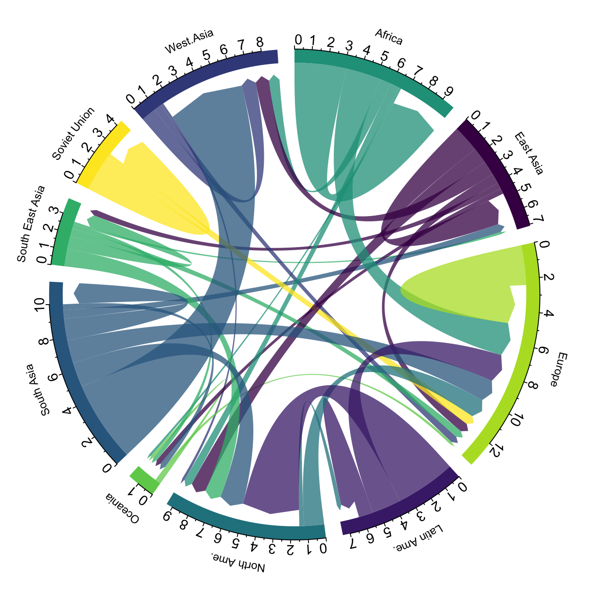

# Libraries

```{r}
library(ggplot2)
library(tidyverse)
```

# Types of Visuals

## Distribution

{width="75"} {width="75"} {width="75"} {width="75"} {width="75"}

-   Visualization of one or multiple **univariate distributions**

-   Stacked versions are difficult to interpret and should be avoided

-   Some require fine-tuning of the parameters to avoid being misleading

### Histogram

```{r}
ggplot(mpg) +
  aes(hwy) +
  geom_histogram()
```

```{r}
ggplot(mpg) +
  aes(hwy, after_stat(density)) +
  geom_histogram()
```

```{r}
ggplot(mpg) +
  aes(hwy) +
  geom_histogram() +
  facet_grid(class ~ .)
```

```{r}
ggplot(mpg) +
  aes(hwy) +
  geom_histogram() +
  facet_grid(
    reorder(class, -hwy, median) ~ .)
```

### Density

```{r}
ggplot(mpg) +
  aes(hwy) +
  geom_density()
```

```{r}
ggplot(mpg) +
  aes(hwy, after_stat(density)) +
  geom_histogram(fill="gray") +
  geom_density()
```

```{r}
ggplot(mpg) +
  aes(hwy, after_stat(density)) +
  geom_histogram(fill="gray") +
  geom_density(adjust=0.2)
```

```{r}
ggplot(mpg) +
  aes(hwy, after_stat(density)) +
  geom_histogram(fill=NA) +
  geom_histogram(fill="gray", bins=10) +
  geom_density()
```

### Box Plot

```{r}
ggplot(mpg) +
  aes(hwy, class) +
  geom_boxplot() +
  labs(y=NULL)
```

```{r}
ggplot(mpg) +
  aes(hwy, reorder(class, hwy, median)) +
  geom_boxplot() +
  labs(y=NULL)
```

```{r}
ggplot(mpg) +
  aes(hwy, reorder(class, hwy, median)) +
  geom_boxplot(outlier.color="red") +
  labs(y=NULL)
```

```{r}
ggplot(mpg) +
  aes(hwy, reorder(class, hwy, median)) +
  geom_boxplot(outlier.color="red") +
  geom_jitter(height=0.2, alpha=0.5) +
  labs(y=NULL)
```

```{r}
ggplot(mpg) +
  aes(hwy, reorder(class, hwy, median)) +
  geom_boxplot(outlier.color="red",
               varwidth=TRUE) +
  geom_jitter(height=0.2, alpha=0.5) +
  labs(y=NULL)
```

```{r}
ggplot(mpg) +
  aes(hwy, reorder(class, hwy, median)) +
  geom_boxplot(aes(color=drv)) +
  labs(y=NULL) +
  theme(legend.position=c(1, 0),
        legend.justification=c(1, 0))
```

```{r}
ggplot(mpg) +
  aes(hwy, reorder(class, hwy, median)) +
  geom_boxplot(aes(fill=drv)) +
  labs(y=NULL) +
  theme(legend.position=c(1, 0),
        legend.justification=c(1, 0))
```

```{r}
ggplot(mpg) +
  aes(hwy, reorder(class, hwy, median)) +
  geom_boxplot(aes(fill=drv),
               varwidth=TRUE) +
  labs(y=NULL) +
  theme(legend.position=c(1, 0),
        legend.justification=c(1, 0))
```

### Violin Plot

```{r}
ggplot(mpg) +
  aes(hwy, reorder(class, hwy, median)) +
  geom_violin() +
  labs(y=NULL)
```

```{r}
ggplot(mpg) +
  aes(hwy, reorder(class, hwy, median)) +
  geom_violin(aes(fill=class)) +
  labs(y=NULL) +
  theme(legend.position="none")
```

```{r}
ggplot(mpg) +
  aes(hwy, reorder(class, hwy, median)) +
  geom_violin(aes(fill=class)) +
  scale_fill_viridis_d() +
  labs(y=NULL) +
  theme(legend.position="none")
```

```{r}
mpg |> mutate(
  class=reorder(class, hwy, median)) |>
ggplot() +
  aes(hwy, class) +
  geom_violin(aes(fill=class)) +
  scale_fill_viridis_d() +
  labs(y=NULL) +
  theme(legend.position="none")
```

### Ridgeline

```{r}
mpg |> mutate(
  class=reorder(class, hwy, median)) |>
ggplot() +
  aes(hwy, class, fill=class) +
  ggridges::geom_density_ridges() +
  scale_fill_viridis_d() +
  labs(y=NULL) +
  theme(legend.position="none")
```

```{r}
mpg |> mutate(
  class=reorder(class, hwy, median)) |>
ggplot() +
  aes(hwy, class, fill=after_stat(x)) +
  ggridges::geom_density_ridges_gradient() +
  scale_fill_viridis_c() +
  labs(y=NULL) +
  theme(legend.position="none")
```

```{r}
mpg |> mutate(
  class=reorder(class, hwy, median)) |>
ggplot() +
  aes(hwy, class, fill=after_stat(x)) +
  ggridges::geom_density_ridges_gradient(
    scale=1) +
  scale_fill_viridis_c() +
  labs(y=NULL) +
  theme(legend.position="none")
```

```{r}
mpg |> mutate(
  class=reorder(class, hwy, median)) |>
ggplot() +
  aes(hwy, class, fill=after_stat(x)) +
  ggridges::geom_density_ridges_gradient(
    scale=1, quantile_lines=TRUE) +
  scale_fill_viridis_c() +
  labs(y=NULL) +
  theme(legend.position="none")
```

```{r}
mpg |> mutate(
  class=reorder(class, hwy, median)) |>
ggplot() +
  aes(hwy, class, fill=0.5 - abs(
    0.5 - after_stat(ecdf))) +
  ggridges::geom_density_ridges_gradient(
    scale=1, calc_ecdf=TRUE) +
  scale_fill_viridis_c("Tail prob.") +
  labs(y=NULL) +
  theme(legend.position=c(1, 0),
        legend.justification=c(1, 0))
```

## Correlation

{width="75"} {width="75"} {width="75"} {width="75"} {width="75"} {width="75"}

-   Visualization of the **relationship** between two variables

-   Two continuous, or two discrete, or mixed

-   Options to include a third one

### Scatter plot

```{r}
gapminder::gapminder |>
  filter(year == 1997) |>
ggplot() +
  aes(gdpPercap, lifeExp) +
  scale_x_log10() +
  geom_point()
```

```{r}
gapminder::gapminder |>
  filter(year == 1997) |>
ggplot() +
  aes(gdpPercap, lifeExp) +
  scale_x_log10() +
  geom_point(aes(color=continent)) +
  theme(legend.position=c(1, 0),
        legend.justification=c(1, 0))
```

```{r}
ggplot(faithful) +
  aes(eruptions, waiting) +
  geom_point()
```

### Bubble

```{r}
gapminder::gapminder |>
  filter(year == 1997) |>
ggplot() +
  aes(gdpPercap, lifeExp) +
  scale_x_log10() +
  geom_point(aes(color=continent,
                 size=pop)) +
  theme(legend.position=c(1, 0),
        legend.justification=c(1, 0))
```

```{r}
gapminder::gapminder |>
  filter(year == 1997) |>
ggplot() +
  aes(gdpPercap, lifeExp) +
  scale_x_log10() +
  geom_point(aes(color=continent,
                 size=pop),
             alpha=0.7) +
  scale_size_area(max_size=20) +
  theme(legend.position=c(1, 0),
        legend.justification=c(1, 0))
```

```{r}
gapminder::gapminder |>
  filter(year == 1997) |>
ggplot() +
  aes(gdpPercap, lifeExp) +
  scale_x_log10() +
  geom_point(aes(color=continent,
                 size=pop),
             alpha=0.7) +
  scale_size_area(max_size=20) +
  geom_smooth() +
  theme(legend.position=c(1, 0),
        legend.justification=c(1, 0))
```

```{r}
gapminder::gapminder |>
  filter(year == 1997) |>
ggplot() +
  aes(gdpPercap, lifeExp) +
  scale_x_log10() +
  geom_point(aes(color=continent,
                 size=pop),
             alpha=0.7) +
  scale_size_area(max_size=20) +
  geom_smooth(method="lm") +
  theme(legend.position=c(1, 0),
        legend.justification=c(1, 0))
```

### Connected Scatter

```{r}
gapminder::gapminder |>
  filter(year == 1997) |>
ggplot() +
  aes(gdpPercap, lifeExp) +
  scale_x_log10() +
  geom_point(aes(color=continent)) +
  geom_line(aes(color=continent)) +
  theme(legend.position=c(1, 0),
        legend.justification=c(1, 0))
```

```{r}
babynames::babynames |>
  filter(name %in% c(
    "Ashley", "Amanda")) |>
  filter(sex == "F") |>
  filter(year > 1970) |>
  select(year, name, n) |>
  spread(key = name, value=n, -1) |>
ggplot() +
  aes(Amanda, Ashley, color=year) +
  geom_point() +
  geom_path() +
  scale_color_viridis_c() +
  theme(legend.position=c(0, 1),
        legend.justification=c(0, 1))
```

```{r}
df <- babynames::babynames |>
  filter(name %in% c(
    "Ashley", "Amanda")) |>
  filter(sex == "F") |>
  filter(year > 1970) |>
  select(year, name, n) |>
  spread(key = name, value=n, -1)
text <- df |>
  filter(year %in% c(
    1972, 1980, 1984, 1987, 2012))
ggplot(df) +
  aes(Amanda, Ashley, color=year) +
  geom_path(arrow=arrow(
    angle=15, type="closed",
    length=unit(0.1, "inches"))) +
  scale_color_viridis_c() +
  geom_label(aes(label=year), text) +
  theme(legend.position=c(0, 1),
        legend.justification=c(0, 1))
```

### Density 2D

```{r}
ggplot(faithful) +
  aes(eruptions, waiting) +
  geom_bin2d() +
  scale_fill_viridis_c() +
  ggside::geom_xsidehistogram() +
  theme(legend.position=c(1, 0),
        legend.justification=c(1, 0))
```

```{r}
ggplot(faithful) +
  aes(eruptions, waiting) +
  geom_bin2d() +
  scale_fill_viridis_c() +
  ggside::geom_xsidehistogram() +
  theme(legend.position=c(1, 0),
        legend.justification=c(1, 0))
```

```{r}
ggplot(faithful) +
  aes(eruptions, waiting) +
  geom_hex() +
  scale_fill_viridis_c() +
  ggside::geom_xsidehistogram() +
  theme(legend.position=c(1, 0),
        legend.justification=c(1, 0))
```

```{r}
ggplot(faithful) +
  aes(eruptions, waiting) +
  geom_density2d_filled() +
  ggside::geom_xsidehistogram() +
  theme(legend.position=c(1, 0),
        legend.justification=c(1, 0))
```

You can control how fine the pexels are in order to adjust the resolution / granularity

```{r}
ggplot(faithfuld) +
  aes(eruptions, waiting, fill=density) +
  geom_raster() +
  scale_fill_viridis_c() +
  theme(legend.position=c(1, 0),
        legend.justification=c(1, 0))
```

```{r}
ggplot(faithfuld) +
  aes(eruptions, waiting, fill=density) +
  geom_raster(interpolate=TRUE) +
  scale_fill_viridis_c() +
  theme(legend.position=c(1, 0),
        legend.justification=c(1, 0))
```

**Categorical Variables:**

### Heatmap

```{r}
mtcars |>
  tibble::rownames_to_column("model") |>
  gather("key", "value", -model) |>
ggplot() +
  aes(key, model, fill=value) +
  geom_tile() +
  scale_fill_viridis_c(
    trans="pseudo_log") +
  labs(x=NULL, y=NULL)
```

```{r}
mtcars |>
  cor(mtcars) |>
  ggcorrplot::ggcorrplot() +
  theme(legend.position="top")
```

When you have the same variables in X and Y, you have a correlogram.

```{r}
mtcars |>
  cor(mtcars) |>
  ggcorrplot::ggcorrplot(
    hc.order=TRUE,
    method="circle") +
  theme(legend.position="top")
```

hc.order is hierarchical clustering order.

```{r}
mtcars |>
  cor(mtcars) |>
  ggcorrplot::ggcorrplot(
    hc.order=TRUE,
    method="circle") +
  theme(legend.position="top")
```

```{r}
GGally::ggpairs(iris)
```

Useful for when you are studying a dataset for the first time. Shows you boxplots across variables. You can also color by a factor.

```{r}
GGally::ggpairs(
  iris,
  aes(color=Species)
)
```

## Ranking

{width="75"} {width="75"} {width="75"} {width="75"} {width="75"} {width="75"}

-   Visualization of the **ranking of a categorical variable**

-   Based on some other numerical variable

-   **Sort your data!**

-   Barplot is the gold standard

```{r}
ggplot(mpg) +
  aes(class) +
  geom_bar() +
  labs(x=NULL)
```

geom_bar is a relic and was the original way to plot a bar chart.

```{r}
mpg |>
  count(drv, class, name="count") |>
ggplot() +
  aes(count, class) +
  geom_col() +
  labs(y=NULL)
```

Reversing x and y makes it a horizontal bar chart. Coord_flip also exists to change this, but now ggplot supports this by switching x and y.

```{r}
mpg |>
  count(drv, class, name="count") |>
ggplot() +
  aes(count, reorder(class, count, sum)) +
  geom_col() +
  labs(y=NULL)
```

This code reorders it by largest to shortest.

```{r}
mpg |>
  count(drv, class, name="count") |>
ggplot() +
  aes(count, reorder(class, count, sum)) +
  geom_col(aes(fill=drv)) +
  labs(y=NULL) +
  theme(legend.position="top")
```

This colors it by drive variable / class.

### Circular Bar Plot

```{r}
mpg |>
  count(drv, class, name="count") |>
ggplot() +
  aes(count, reorder(class, count, sum)) +
  geom_col(aes(fill=drv)) +
  coord_polar(theta="y") +
  labs(y=NULL) +
  theme(legend.position="top")
```

This skews data by area, so not recommended.

### Lollipop Chart

```{r}
mpg |>
  count(drv, class, name="count") |>
ggplot() +
  aes(count, reorder(class, count, sum)) +
  geom_segment(aes(xend=0, yend=class)) +
  geom_point(size=3) +
  labs(y=NULL)
```

This is helpful for showing the difference between two things, but not for stacked charts. In those cases, a bar chart is much better. In a lollipop chart it is not clear if the measurement is between dots or from zero to the dot.

```{r}
mpg |>
  count(drv, class, name="count") |>
ggplot() +
  aes(count, reorder(class, count, sum)) +
  aes(color=drv) +
  geom_segment(aes(xend=0, yend=class)) +
  geom_point(size=3) +
  labs(y=NULL) +
  theme(legend.position=c(1, 0),
        legend.justification=c(1, 0))
```

### Parallel Coordinates

```{r}
iris |>
  tibble::rowid_to_column("id") |>
  gather("key", "value", -Species, -id) |>
ggplot() +
  aes(key, value, color=Species) +
  geom_point(alpha=0.5) +
  geom_line(aes(group=id), alpha=0.3) +
  scale_color_viridis_d() +
  labs(x=NULL) +
  theme(legend.position="top")
```

You have four different species of flowers; it is clear to see the relationship between the different measurements. Adding more factors can make it easier to cluster observations together. We want to avoid the insinuation that this is some sort of evolution (like a line chart). Usually what people do is remove everything from the x axis besides the tick and the label. You need to use `rowid_to_column` to make sure that `geom_line` works.

The line is connecting values for one observation for various categories.

```{r}
iris |>
  tibble::rowid_to_column("id") |>
  gather("key", "value", -Species, -id) |>
  group_by(key) |>
  mutate(value = scale(value)) |>
ggplot() +
  aes(key, value, color=Species) +
  geom_point(alpha=0.5) +
  geom_line(aes(group=id), alpha=0.3) +
  scale_color_viridis_d() +
  labs(x=NULL, y="Std. value") +
  theme(legend.position="top")
```

This is an example of scaling values so they don't look ridiculous. For example, comapring countries with GDP, life expectancy, etc that have all various scales, it would make things look nuts. This helps visualize this in the same scale.

## Part of a Whole

{width="75"} {width="75"} {width="75"} {width="75"} {width="75"} {width="75"}

-   Visualization of **proportions**

-   Some charts are also able to convey **hierarchies**

-   Some are rarely appropriate

-   Bar chart is still the gold standard

### Stacked Bar plot

```{r}
mpg |>
  count(drv, class, name="count") |>
ggplot() +
  aes(count, reorder(class, count, sum)) +
  geom_col(aes(fill=drv)) +
  labs(y=NULL) +
  theme(legend.position="top")
```

```{r}
mpg |>
  count(drv, class, name="count") |>
  group_by(class) |>
  mutate(prop = count / sum(count)) |>
ggplot() +
  aes(prop, reorder(class, count, sum)) +
  geom_col(aes(fill=drv)) +
  labs(y=NULL) +
  theme(legend.position="top")
```

Always work with proportions, label the x axis as a percentage and it means it is easier to add data.

### Pie Chart

```{r}
data.frame(
  category=c("A", "B", "C"),
  prop=c(0.1, 0.6, 0.3)) |>
ggplot() +
  aes(1, prop) +
  geom_col(aes(fill=category))
```

```{r}
data.frame(
  category=c("A", "B", "C"),
  prop=c(0.1, 0.6, 0.3)) |>
ggplot() +
  aes(1, prop) +
  geom_col(aes(fill=category)) +
  coord_polar(theta="y") +
  theme_void(base_size=16)
```

### Doughnut

```{r}
data.frame(
  category=c("A", "B", "C"),
  prop=c(0.1, 0.6, 0.3)) |>
ggplot() +
  aes(1, prop) +
  geom_col(aes(fill=category)) +
  xlim(c(-0.5, 1.5))
```

```{r}
data.frame(
  category=c("A", "B", "C"),
  prop=c(0.1, 0.6, 0.3)) |>
ggplot() +
  aes(1, prop) +
  geom_col(aes(fill=category)) +
  xlim(c(-0.5, 1.5)) +
  coord_polar(theta="y") +
  theme_void(base_size=16)
```

### Circular Packings

```{r}
library(packcircles)
df <- mpg |>
  count(class, name="count")
df <- cbind(df, circleProgressiveLayout(
  df$count, sizetype="area"))
ggplot(df) +
  aes(x0=x, y0=y, r=radius) +
  ggforce::geom_circle()
```

A circular packing plot, also called a circular treemap, is **a data visualization that displays hierarchical data using a set of nested circles**. The size of each circle is typically proportional to a data point's value, and sub-levels of the hierarchy are shown as smaller circles nested inside larger ones. This method is useful for visualizing large amounts of hierarchical data in a compact space.

geom_circle allows you to plot circles. You need to pick the radius.

```{r}
library(packcircles)
df <- mpg |>
  count(class, name="count")
df <- cbind(df, circleProgressiveLayout(
  df$count, sizetype="area"))
ggplot(df) +
  aes(x0=x, y0=y, r=radius) +
  ggforce::geom_circle(aes(
    fill=class), color=NA) +
  coord_fixed() +
  geom_text(aes(x, y, label=class)) +
  theme_void(base_size=16) +
  theme(legend.position="none")
```

There is no ordering here, this is just plotting the circles as closely as possible. The function `circleProgressiveLayout` makes sure the circles don't collide.

```{r}
library(packcircles)
df <- data.frame(
  x = c(0, 1, 0, 1),
  y = c(0, 0, 1, 1),
  radius = c(0.7, 0.5, 0.6, 1.2))
ggplot(df) +
  aes(x0=x, y0=y, r=radius) +
  ggforce::geom_circle() +
  geom_point(aes(x, y), color="red") +
  coord_fixed() +
  theme_void(base_size=16) +
  theme(legend.position="none")
```

```{r}
edges <- ggraph::flare$edges
vertices <- ggraph::flare$vertices
graph <- igraph::graph_from_data_frame(
  edges, vertices=vertices)
ggraph::ggraph(graph,
               layout="circlepack",
               weight=size) +
  ggraph::geom_node_circle() +
  theme_void(base_size=16)
```

You can stack circular packing inside of circular packing as long as it is hierarchical data.

```{r}
edges <- ggraph::flare$edges
vertices <- ggraph::flare$vertices
graph <- igraph::graph_from_data_frame(
  edges, vertices=vertices)
ggraph::ggraph(graph,
               layout="circlepack",
               weight=size) +
  ggraph::geom_node_circle(
    aes(fill=depth)) +
  scale_fill_viridis_c() +
  coord_fixed() +
  theme_void(base_size=16)
```

Tree Map

```{r}
edges <- ggraph::flare$edges
vertices <- ggraph::flare$vertices
graph <- igraph::graph_from_data_frame(
  edges, vertices=vertices)
ggraph::ggraph(graph,
               layout="treemap",
               weight=size) +
  ggraph::geom_node_tile(
    aes(fill=depth)) +
  scale_fill_viridis_c() +
  theme_void(base_size=16)
```

A set of rectangles that represent part of a whole that takes up less space than the circles.

### Dendrogram

```{r}
edges <- ggraph::flare$edges
vertices <- ggraph::flare$vertices
graph <- igraph::graph_from_data_frame(
  edges, vertices=vertices)
ggraph::ggraph(graph,
               layout="tree") +
  ggraph::geom_edge_diagonal() +
  theme_void(base_size=16)
```

```{r}
edges <- ggraph::flare$edges
vertices <- ggraph::flare$vertices
graph <- igraph::graph_from_data_frame(
  edges, vertices=vertices)
ggraph::ggraph(graph,
               layout="dendrogram") +
  ggraph::geom_edge_diagonal() +
  theme_void(base_size=16)
```

```{r}
df <- hclust(dist(iris[, 1:4]))
ggraph::ggraph(df,
               layout="dendrogram",
               height=height) +
  ggraph::geom_edge_elbow() +
  theme_void(base_size=16)
```

```{r}
df <- hclust(dist(iris[, 1:4]))
ggraph::ggraph(df,
               layout="dendrogram",
               circular=TRUE) +
  ggraph::geom_edge_elbow() +
  coord_fixed() +
  theme_void(base_size=16)
```

## Evolution

{width="75"} {width="75"} {width="75"} {width="75"} {width="75"}

-   Visualization of the **evolution** of series

-   Individual data points are not important

-   When `x` is time -\> **time series**

-   Lineplots are the gold standard

### Line plot

```{r}
ggstream::blockbusters |>
  filter(genre == "Action") |>
ggplot() +
  aes(year, box_office) +
  geom_line()
```

You may want to highlight specific points or plot the specific points if you have a smaller quantity of data.

### Area plot

```{r}
ggstream::blockbusters |>
  filter(genre == "Action") |>
ggplot() +
  aes(year, box_office) +
  geom_area()
```

Same thing but highlights area underneath.

### Time Series

```{r}
ggstream::blockbusters |>
  mutate(date = as.Date(
    ISOdate(year, 1, 1))) |>
  filter(genre == "Action") |>
ggplot() +
  aes(date, box_office) +
  geom_line()
```

In a time-series, it is good to set the x axis a date. `as.Date` is number of days since January 1st, 1970. `as.Date` means as we zoom in we would see months, days, etc. ISO and PISOX are ways to standardize dates so the computer can understand them.

```{r}
ggstream::blockbusters |>
  mutate(date = as.Date(
    ISOdate(year, 1, 1))) |>
ggplot() +
  aes(date, box_office) +
  geom_line(aes(color=genre))
```

```{r}
ggstream::blockbusters |>
  mutate(date = as.Date(
    ISOdate(year, 1, 1))) |>
  mutate(genre = forcats::fct_reorder2(
    genre, year, box_office)) |>
ggplot() +
  aes(date, box_office) +
  geom_line(aes(color=genre))
```

If you don't reorder, you get alphabetical by default. To change this, use `reorder()`.

### Stacked Area

```{r}
ggstream::blockbusters |>
  mutate(date = as.Date(
    ISOdate(year, 1, 1))) |>
ggplot() +
  aes(date, box_office) +
  geom_area(aes(fill=genre))
```

### Stream Chart

```{r}
ggstream::blockbusters |>
  mutate(date = as.Date(
    ISOdate(year, 1, 1))) |>
ggplot() +
  aes(date, box_office) +
  ggstream::geom_stream(
    aes(fill=genre),
    type="ridge")
```

Same as `geom_area`, but smoothed lines. A bit misleading, since you lose granularity of points.

```{r}
ggstream::blockbusters |>
  mutate(date = as.Date(
    ISOdate(year, 1, 1))) |>
ggplot() +
  aes(date, box_office) +
  ggstream::geom_stream(
    aes(fill=genre),
    type="mirror")
```

Mirror image of y axis? The y aix doesn't have any meaning anymore.

```{r}
ggstream::blockbusters |>
  mutate(date = as.Date(
    ISOdate(year, 1, 1))) |>
ggplot() +
  aes(date, box_office) +
  ggstream::geom_stream(
    aes(fill=genre),
    type="proportional")
```

Part of whole, proportions. Vertical axis is 100%.

## Map

{width="75"} {width="75"} {width="75"} {width="75"} {width="75"} {width="75"}

-   Visualizaton of **geospatial data**

-   Usually, the map is just a reference

-   Sometimes, it **encodes** the information

### Map

```{r}
world <- giscoR::gisco_get_countries()
ggplot(world) +
  geom_sf()
```

"world" is dataset for country. `geom_sf` plots the data.

```{r}

usa <- sf::st_as_sf(maps::map(
  "state", plot=FALSE, fill=TRUE))
ggplot(usa) +
  geom_sf()
```

`st_as_sf()` converts data to sf format.

```{r}
africa <- giscoR::gisco_get_countries(
    region="Africa")
ggplot(africa) +
  geom_sf()
```

The axises are weird because Africa has many islands.

```{r}
africa <- giscoR::gisco_get_countries(
    region="Africa")
ggplot(africa) +
  geom_sf() +
  coord_sf(xlim=c(-20, 50),
           ylim=c(-40, 40))
```

We are zooming into the continental part.

```{r}
africa <- giscoR::gisco_get_countries(
    region="Africa") |>
  left_join(
    africamonitor::am_data(
      series="SP_POP_TOTL",
      from=2021, to=2021),
    by=c("ISO3_CODE"="ISO3"))
ggplot(africa) +
  geom_sf(aes(fill=SP_POP_TOTL)) +
  coord_sf(xlim=c(-20, 50),
           ylim=c(-40, 40)) +
  scale_fill_viridis_c() +
  labs(fill="Population") +
  theme(legend.position=c(0, 0),
        legend.justification=c(0, 0))
```

Joins the data of population by ISO code to sf data.

### Cartogram

```{r}
africa <- giscoR::gisco_get_countries(
    region="Africa") |>
  left_join(
    africamonitor::am_data(
      series="SP_POP_TOTL",
      from=2021, to=2021),
    by=c("ISO3_CODE"="ISO3")) |>
  sf::st_transform(3857) |>
  cartogram::cartogram_cont(
    "SP_POP_TOTL", itermax=5) |>
  sf::st_transform(4326)
ggplot(africa) +
  geom_sf(aes(fill=SP_POP_TOTL)) +
  coord_sf(xlim=c(-20, 50),
           ylim=c(-40, 40)) +
  scale_fill_viridis_c() +
  labs(fill="Population") +
  theme(legend.position=c(0, 0),
        legend.justification=c(0, 0))
```

Performs geometry with the country so the area is proportional to the population it holds.

### Bubble Map

```{r}
africa <- giscoR::gisco_get_countries(
    region="Africa") |>
  left_join(
    africamonitor::am_data(
      series="SP_POP_TOTL",
      from=2021, to=2021),
    by=c("ISO3_CODE"="ISO3"))
centroids <- africa |>
  sf::st_centroid()
ggplot(centroids) +
  geom_sf(data=africa) +
  geom_sf(aes(size=SP_POP_TOTL)) +
  coord_sf(xlim=c(-20, 50),
           ylim=c(-40, 40)) +
  labs(size="Population") +
  theme(legend.position=c(0, 0),
        legend.justification=c(0, 0))
```

These dots go in the center of the region. When you have a complex region, it is not so clear. Use `st_centroid()` to find the center. You have two layers: one for the map data and one for the population circles.

### Connection Maps

```{r}
africa <- giscoR::gisco_get_countries(
    region="Africa") |>
  left_join(
    africamonitor::am_data(
      series="SP_POP_TOTL",
      from=2021, to=2021),
    by=c("ISO3_CODE"="ISO3"))
centroids <- africa |>
  sf::st_centroid()
lines <- centroids |>
  sf::st_union() |>
  sf::st_cast("LINESTRING")
ggplot(lines) +
  geom_sf(data=africa) +
  geom_sf(aes(size=SP_POP_TOTL),
          data=centroids) +
  geom_sf() +
  coord_sf(xlim=c(-20, 50),
           ylim=c(-40, 40)) +
  labs(size="Population") +
  theme(legend.position=c(0, 0),
        legend.justification=c(0, 0))
```

Connects flow from centroids with lines. You need linestrings. With `geom_sf` you can draw any kind of geometry you'd like.

### Hexbin Map

```{r}
esp <- mapSpain::esp_get_country()
hexccaa <- mapSpain::esp_get_hex_ccaa()
ggplot(hexccaa) +
  geom_sf(data=esp) +
  geom_sf(aes(fill=codauto),
          alpha=0.3,
          show.legend=FALSE) +
  geom_sf_text(
    aes(label=label),
    check_overlap=TRUE) +
  theme_void(base_size=16)
```

Works well with Spanish communities and US states.

```{r}
esp <- mapSpain::esp_get_country()
hexprov <- mapSpain::esp_get_hex_prov()
ggplot(hexprov) +
  geom_sf(data=esp) +
  geom_sf(aes(fill=codauto),
          alpha=0.3,
          show.legend=FALSE) +
  geom_sf_text(
    aes(label=label),
    check_overlap=TRUE) +
  theme_void(base_size=16)
```

Also works well with provinces.

```{r}
esp <- mapSpain::esp_get_country()
gridprov <- mapSpain::esp_get_grid_prov()
ggplot(gridprov) +
  geom_sf(data=esp) +
  geom_sf(aes(fill=codauto),
          alpha=0.3,
          show.legend=FALSE) +
  geom_sf_text(
    aes(label=label),
    check_overlap=TRUE) +
  theme_void(base_size=16)
```

Can also work with rectangles.

## Flow

{width="75"} {width="75"} {width="75"} {width="75"} {width="75"}

-   Visualization of **interconnection** between entities

-   Generally, two datasets are required: **nodes** and **edges**

-   Data wrangling is a bit different

-   you have two dataframes: one with edges and their info, and one with nodes and their info

### Flow Network

```{r}
library(ggraph)
library(tidygraph)
as_tbl_graph(highschool) |>
  mutate(Popularity = centrality_degree(
    mode="in")) |>
ggraph(layout="kk") +
  geom_node_point(
    aes(size=Popularity)) +
  theme(legend.position="top")
```

`ggraph` is a good extension for network data. `tidygraph` is the `dplyr` for network data.

```{r}
library(ggraph)
library(tidygraph)
as_tbl_graph(highschool) |>
  mutate(Popularity = centrality_degree(
    mode="in")) |>
ggraph(layout="kk") +
  geom_node_point(
    aes(size=Popularity)) +
  geom_edge_link(
    arrow=arrow(
      length=unit(0.1, "inches"),
      type="closed")) +
  theme(legend.position="top")
```

When plotting networks, you need to set a layout. There are many layouts. We are using "kk" in this example. The arrows are not very good because they interact with points with the nodes.

```{r}
library(ggraph)
library(tidygraph)
as_tbl_graph(highschool) |>
  mutate(Popularity = centrality_degree(
    mode="in")) |>
ggraph(layout="kk") +
  geom_node_point(
    aes(size=Popularity)) +
  geom_edge_fan(
    aes(alpha=after_stat(index)),
    show.legend=FALSE) +
  theme(legend.position="top")
```

With this you get curvature for the lines so they don't overlap.

```{r}
library(ggraph)
library(tidygraph)
as_tbl_graph(highschool) |>
  mutate(Popularity = centrality_degree(
    mode="in")) |>
ggraph(layout="kk") +
  geom_node_point(
    aes(size=Popularity)) +
  geom_edge_fan(
    aes(alpha=after_stat(index),
        color=factor(year)),
    show.legend=FALSE) +
  theme(legend.position="top")
```

Coloring

```{r}
library(ggraph)
library(tidygraph)
as_tbl_graph(highschool) |>
  mutate(Popularity = centrality_degree(
    mode="in")) |>
ggraph(layout="kk") +
  geom_node_point(
    aes(size=Popularity)) +
  geom_edge_fan(
    aes(alpha=after_stat(index)),
    show.legend=FALSE) +
  facet_edges(~year, ncol=1) +
  theme(legend.position="top")
```

Faceting

```{r}
library(ggraph)
library(tidygraph)
as_tbl_graph(highschool) |>
  mutate(Popularity = centrality_degree(
    mode="in")) |>
ggraph(layout="kk") +
  geom_node_point(
    aes(size=Popularity)) +
  geom_edge_fan(
    aes(alpha=after_stat(index)),
    show.legend=FALSE) +
  facet_edges(~year, ncol=1) +
  theme_graph(base_size=16,
              foreground="#a53253",
              fg_text_colour="white") +
  theme(legend.position="top")
```

Themes

### Arc Diagram

```{r}
library(ggraph)
library(tidygraph)
as_tbl_graph(highschool) |>
  mutate(Popularity = centrality_degree(
    mode="in")) |>
ggraph(layout="linear") +
  geom_node_point(
    aes(size=Popularity)) +
  geom_edge_arc(
    aes(alpha=after_stat(index)),
    show.legend=FALSE) +
  facet_edges(~year, ncol=1) +
  theme_graph(base_size=16,
              foreground="#a53253",
              fg_text_colour="white") +
  theme(legend.position="top")
```

### Circular diagram

```{r}
library(ggraph)
library(tidygraph)
as_tbl_graph(highschool) |>
  mutate(Popularity = centrality_degree(
    mode="in")) |>
ggraph(layout="linear", circular=TRUE) +
  coord_fixed() +
  geom_node_point(
    aes(size=Popularity)) +
  geom_edge_arc(
    aes(alpha=after_stat(index)),
    show.legend=FALSE) +
  facet_edges(~year, ncol=1) +
  theme_graph(base_size=16,
              foreground="#a53253",
              fg_text_colour="white") +
  theme(legend.position="top")
```

### Edge Bundling

```{r}
library(ggraph)
library(tidygraph)
# flareGraph <- ...
# importFrom <- ...
# importTo <- ...
ggraph(flareGraph, "dendrogram",
       circular=TRUE) +
  coord_fixed() +
  geom_node_point() +
  theme_graph(base_size=16)
```

Algorithm you apply to the edges connecting the nodes so the ones that are closer are closer.(??)

```{r}
library(ggraph)
library(tidygraph)
# flareGraph <- ...
# importFrom <- ...
# importTo <- ...
ggraph(flareGraph, "dendrogram",
       circular=TRUE) +
  coord_fixed() +
  geom_node_point(
    aes(filter=leaf, color=class)) +
  geom_conn_bundle(
    aes(color=after_stat(index)),
    data=get_con(importFrom, importTo),
    edge_alpha=0.25) +
  theme_graph(base_size=16) +
  theme(legend.position="top")
```

`Ggraph` is computing these bundles themself with `geom_conn_bundle`.

### [Chord Diagram](https://www.data-to-viz.com/graph/chord.html)

{width="409"}

Too complex for this class. Amount of something that goes into something. i.e. amount of immigration from one country to another country. These are not packages available in ggplot.

### Sankey / Alluvial

```{r}
# remotes::install_github(
#   "davidsjoberg/ggsankey")
df <- mtcars |>
  ggsankey::make_long(
    cyl, vs, am, gear, carb)
ggplot(df) +
  aes(x, next_x=next_x,
      node=node, next_node=next_node,
      fill=factor(node)) +
  ggsankey::geom_sankey() +
  scale_fill_viridis_d() +
  labs(x=NULL) +
  theme(legend.position="top")
```

A sankey diagram is **a visualization used to depict a flow from one set of values to another**. The things being connected are called nodes and the connections are called links.

Alluvial diagrams are **a type of flow diagram showing changes in group composition between category fields**. The thickness of each stream or link shows its proportional value.

Alluvial and Sankey diagrams are both flow visualizations, but **alluvial diagrams are best for categorical data over time or across stages**, while **Sankey diagrams are ideal for visualizing continuous flows, like energy or material, from one set of values to another**.

```{r}
# remotes::install_github(
#   "davidsjoberg/ggsankey")
df <- mtcars |>
  ggsankey::make_long(
    cyl, vs, am, gear, carb)
ggplot(df) +
  aes(x, next_x=next_x,
      node=node, next_node=next_node,
      fill=factor(node)) +
  ggsankey::geom_sankey(
    flow.alpha=0.6,
    node.color="gray30") +
  scale_fill_viridis_d() +
  labs(x=NULL) +
  theme(legend.position="top")
```

Adds stronger visuals for the nodes.

```{r}
# remotes::install_github(
#   "davidsjoberg/ggsankey")
df <- mtcars |>
  ggsankey::make_long(
    cyl, vs, am, gear, carb)
ggplot(df) +
  aes(x, next_x=next_x,
      node=node, next_node=next_node,
      fill=factor(node),
      label=node) +
  ggsankey::geom_sankey(
    flow.alpha=0.6,
    node.color="gray30") +
  ggsankey::geom_sankey_label(
    size=3, color="white",
    fill="gray40") +
  scale_fill_viridis_d() +
  labs(x=NULL) +
  theme(legend.position="none")
```

Labels for nodes.

```{r}
# remotes::install_github(
#   "davidsjoberg/ggsankey")
df <- mtcars |>
  ggsankey::make_long(
    cyl, vs, am, gear, carb)
ggplot(df) +
  aes(x, next_x=next_x,
      node=node, next_node=next_node,
      fill=factor(node),
      label=node) +
  ggsankey::geom_sankey(
    flow.alpha=0.6,
    node.color="gray30") +
  ggsankey::geom_sankey_label(
    size=3, color="white",
    fill="gray40") +
  scale_fill_viridis_d() +
  ggsankey::theme_sankey(base_size=16) +
  labs(x=NULL) +
  theme(legend.position="none")
```

Themes and removing axises.

### Geospatial Network

```{r}
library(tidygraph)
library(sfnetworks)
net <- as_sfnetwork(roxel, directed=F) |>
  activate("nodes") |>
  mutate(bc = centrality_betweenness())
ggplot() +
  geom_sf(data=sf::st_as_sf(net, "edges"),
          color="grey50") +
  geom_sf(data=sf::st_as_sf(net, "nodes"),
          aes(color=bc)) +
  scale_color_viridis_c() +
  theme(legend.position=c(1, 0),
        legend.justification=c(1, 0))
```

Networks in maps. `sfnetwork` is a package that deals with network data but in sf data. This is a network and an sf object. The nodes and edges are plotted separately.

```{r}
library(ggraph)
library(tidygraph)
library(sfnetworks)
net <- as_sfnetwork(roxel, directed=F) |>
  activate("nodes") |>
  mutate(bc = centrality_betweenness())
ggraph(net) +
  geom_edge_link(color="grey50") +
  geom_node_point(aes(color=bc)) +
  scale_color_viridis_c() +
  theme(legend.position=c(1, 0),
        legend.justification=c(1, 0))
```

This is a geospatial network with ggraph plotting the nodes and edges. This is a "nice" plot. We will modify this layout to include geospatial coordinates.

```{r}
library(ggraph)
library(tidygraph)
library(sfnetworks)
net <- as_sfnetwork(roxel, directed=F) |>
  activate("nodes") |>
  mutate(bc = centrality_betweenness())
layout_sf <- function(graph) {
  graph <- activate(graph, "nodes")
  data.frame(
    x=sf::st_coordinates(graph)[,"X"],
    y=sf::st_coordinates(graph)[,"Y"])
} 
ggraph(net, layout=layout_sf) +
  geom_edge_link(color="grey50") +
  geom_node_point(aes(color=bc)) +
  scale_color_viridis_c() +
  theme(legend.position=c(1, 0),
        legend.justification=c(1, 0))
```

This cleans up the previous data.

```{r}
library(ggraph)
library(tidygraph)
library(sfnetworks)
net <- as_sfnetwork(roxel, directed=F) |>
  activate("nodes") |>
  mutate(bc = centrality_betweenness())
layout_sf <- function(graph) {
  graph <- activate(graph, "nodes")
  data.frame(
    x=sf::st_coordinates(graph)[,"X"],
    y=sf::st_coordinates(graph)[,"Y"])
}
ggraph(net, layout=layout_sf) +
  geom_edge_link(color="grey50") +
  geom_node_point(aes(color=bc)) +
  coord_sf(crs=sf::st_crs(net)) +
  scale_color_viridis_c() +
  theme(legend.position=c(1, 0),
        legend.justification=c(1, 0))
```

This adds the correct coordinate system which accounts to any distortion we may apply to the plot.

## Other resources

{width="75"} {width="75"} {width="75"} {width="75"}

### Animation

```{r}
ggplot(gapminder::gapminder) +
  aes(gdpPercap, lifeExp) +
  geom_point(aes(size=pop,
                 color=continent),
             alpha=0.7) +
  scale_size(range=c(2, 12), guide=NULL) +
  scale_x_log10() +
  theme(legend.position=c(1, 0),
        legend.justification=c(1, 0)) +
  gganimate::transition_time(year) +
  gganimate::ease_aes("linear") +
  labs(title="Year: {frame_time}")
```

gganimate package

### Interactivity

```{r}
ggplot(gapminder::gapminder) +
  aes(gdpPercap, lifeExp) +
  geom_point(aes(size=pop,
                 color=continent),
             alpha=0.7) +
  scale_size(range=c(2, 12), guide=NULL) +
  scale_x_log10() +
  theme_gray(base_size=10) +
  aes(frame=year, text=country) -> p
plotly::ggplotly(p) |>
  plotly::layout(legend=list(
    x=1, y=0, xanchor="right"))
```

ggplotly package

### [Caveats](https://www.data-to-viz.com/caveats.html)

A website, data-to-dataviz, with many interesting articles.

### [Data Viz Inspiration](https://www.dataviz-inspiration.com/)

This website has lots of charts for inspiration.

### [Data Art](https://www.data-to-art.com/)

People use ggplot to make art. Esteban Moro was a professor in this master. He has some beautiful visualizations and art as well.

### [Data-to-Viz](https://www.data-to-viz.com/)

This is a resource from a newsletter that Emma (Stats II) shared. It is helpful for deciding on charts.

### [1 Dataset 100 Visualizations](https://100.datavizproject.com/)

### [GGplot Extensions](https://exts.ggplot2.tidyverse.org/gallery/)

### [GGplot Tutorials](https://github.com/erikgahner/awesome-ggplot2)

Flowmapper is interesting for network flows.

Donutsk is helpful for circular things.

GGblend helps with overplotting issues.
