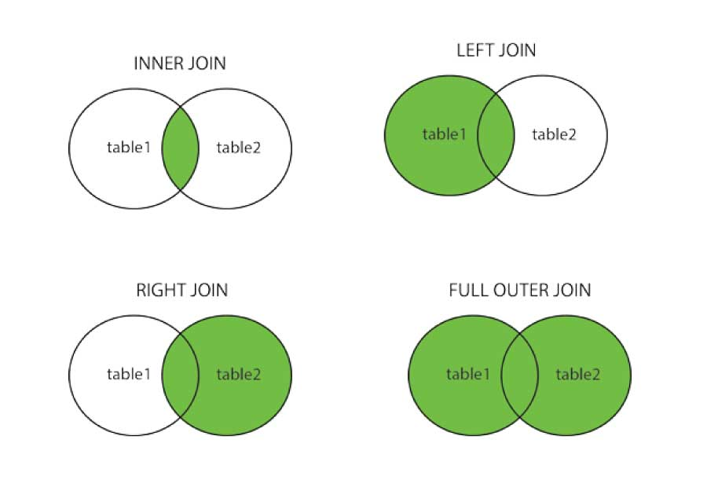

```{r}
library(tidyverse)
library(dplyr)
```

## Joins

We will be interested in cross-referencing data across two tables. Joins allow us to access this information.

It is important that in both databases there is an ID column. Each row needs to have a unique ID. If you don't have one, you can make one.

-   `inner_join()`: only records that exist in **both** table1 and table2 will survive.

-   `full_join()`: keeps **all records in both** tables.

-   `left_join()`: keeps **all the records of the first table**, and looks for which ones have id also in the second one (in case of **not having it, it fills with NA** the fields of the 2nd table). The "left" is what comes before the pipe in the operation.

-   `right_join()`: keeps **all records in the second table**, and searches which ones have id also in the first one. The "left" is still what comes before the pipe in the operation. Usually, you use left join.



```{r}
band_members |>
  left_join(band_instruments, by = "name") # if the columns have the same name, you can just specify one. If they have the same name and you don't specify, the system will assume that will be the key column.
band_members |>
  right_join(band_instruments, by = "name") # reverses table
band_members |>
  inner_join(band_instruments, by = "name") #two rows, only contains overlapping information
band_members |>
  full_join(band_instruments, by = "name")
```

##### What happens if the key column does not have the same name?

Rename column:

```{r}
band_members <- band_members |>
  dplyr::rename(artist = name)
```

Join by conflicting names of key column.

```{r}
band_members |>
  left_join(band_instruments, by = c("artist" = "name"))
```

##### Joining with Multiple Key Columns:

```{r}
tb_1 <- tibble("k_11" = 1:3, "k_12" = c("a", "b", "c"),  "val_x" = c("x1", "x2", "x3"))
tb_2 <- tibble("k_21" = c(1, 2, 4), "k_22" = c("a", "b", "e"), "val_y" = c("y1", "y2", "y3"))
```

```{r}
tb_1 |>
  left_join(tb_2, by = c("k_11" = "k_21", "k_12" = "k_22"))
```

##### [Slide 324](https://javieralvarezliebana.es/docencia/mucss-data-programming/slides/#/tu-turno-6-2)

```{r}
library(nycflights13)
```

```{r}
flights
airlines
planes
airports
```

1.  From package `{nycflights13}` incorporates into the `flights` table the airline data in `airlines`. We want to maintain all flight records, adding the airline information to the airlines table.

```{r}
join1 <- flights |>
  left_join(airlines, by = "carrier")
join1
```

2.  To the table obtained from the crossing of the previous section, include the data of the aircraft in `planes`, but including only those flights for which we have information on their aircraft (and vice versa).

```{r}
join2 <- join1 |>
  inner_join(planes, by = "tailnum")
join2
```

By default, if two tables have the same variable name, but do not represent the same concept, tibble will add .x for columns that come from the first table and .y for columns that come from the second table.

3.  Repeat the previous exercise but keeping both `year` variables (in one is the year of flight, in the other is the year of construction of the aircraft), and distinguishing them from each other

```{r}
join3 <- join1 |>
  inner_join(planes, by = "tailnum", suffix = c("_flight", "_manufact"))
join3
```

"\_flight" would apply to all columns from table 1 that need a suffix (replacing .x) and "\_manufact" would apply to all columns from table 2 that need a suffix (replacing .y). Regardless of which column in the table, they receive the same treatment.

4.  To the table obtained from the previous exercise includes the longitude and latitude of the airports in `airports`, distinguishing between the latitude/longitude of the airport at destination and at origin.

```{r}
join4 <- join3 |>
  # selects 3 columns I need and maps faa to origin information
  left_join(airports |> 
            select(lat, lon, faa),
            by = c("origin" = "faa")) |>
  # selects 3 columns I need and maps faa to destination information
  left_join(airports |> 
            select(lat, lon, faa),
            by = c("dest" = "faa"),
            suffix = c("_origin", "_dest"))
```

5.  Filter from `airports` only those airports from which flights depart.

```{r}
airports |>
  semi_join(flights, by = c("faa" = "origin"))
```

Repeat the process filtering only those airports where flights arrive.

```{r}
airports |>
  semi_join(flights, by = c("faa" = "dest"))
```

6.  How many flights do we not have information about the aircraft? Eliminate flights that do not have an aircraft ID (other than NA) beforehand.

```{r}
flights |>
  drop_na(tailnum) |>
  anti_join(planes, by = "tailnum") |>
  count(tailnum, sort = TRUE) |>
  count()
```

#### Semi-Join and Anti-Join

These are what Javi calls "fake joins". These work the same way as previous joins, but are different because they are not actually joins.

Assume we have two tables:

```{r}
table1 <- tibble(id = c("a", "b", "c", "d"),
                 "var1" = 1:4)
table2 <- tibble(id = c("a", "d", "e", "f"),
                 "var2" = c(-1, 0, 3, 2))
```

The **semi join** leaves us in the **first table the records whose key is also in the second table** (like an inner join but without adding the info from the second table).

```{r}
table1 |>
  semi_join(table2, by = "id")
```

This "filters" the data by whatever exists in table2.

```{r}
table1 |> filter(id %in% table2$id)
# filter table 1 by id in table 2
```

This does the same as the above code.

Because this join does not include new columns, it is not a real join.

And the second one, the anti join, does just the opposite (those that are not).

```{r}
table1 |>
  anti_join(table2, by = "id")
```
