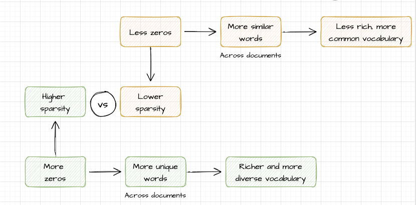

# Conversion to and from tidytext

So far, we have been working with text in the tidy format, which is one token per row in this structure:

| Document   | Word / term | Count |
|------------|-------------|-------|
| Document 1 | word 1      | 65    |
| Document 1 | word 2      | 23    |
| Document 2 | word 3      | 18    |

The `tidytext` package has allowed us to work directly with libraries like `dplyr`, `tidyr` or `ggplot2`.

However, there are other text formats to work with, and we need to be able to combine the tidy text with other data structures.

### Document-term matrix

The document-term matrix (DTM) is a common structure for text mining packages to work with, where:

-   Each row is a document

-   Each column is a term

-   Values are the number of appearances of each term in each document

|                | Term 1 | Term 2 | Term 3 |
|----------------|--------|--------|--------|
| **Document 1** | 7      | 4      | 12     |
| **Document 2** | 21     | 8      | 5      |
| **Document 3** | 15     | 11     | 1      |

Nevertheless, this example does not reflect what happens in real life. **Normally, most pairings of document and term do not occur, so most elements have a zero value**. We need to convert the matrix into a sparse matrix.

To represent our text collection, we save a sparse matrix with only non-zeros and their positions for two reasons:

-   Because we are only interested in non-zero elements (terms actually appearing in documents).

-   Because they are more efficient by saving memory and computation.

### Conversion from tidytext to DTM and back

To convert a collection of texts from a DTM to the tidy format we use the function `tidy()`.

To convert from texts in tidy format to DTMs, we use the function `cast()`, which offers three different options:

-   cast_sparse() converts into a sparse matrix of the `Matrix` package

-   cast_dtm() converts into a dtm of the `tm` package **(most common)**

-   cast_dfm() converts into a dfm object from `quanteda` package


Quanteda is a text mining package that we will be exploring further in next sections.

### From DTM to tidy: newspaper articles

Let's begin by exploring a real DTM of newspaper articles from the Associated Press. It is a bunch of data included in the `topicmodels` package. Just have a look at it.

```{r}
# install.packages("topicmodels")
```

```{r}
library(tm)

data("AssociatedPress", package = "topicmodels")
AssociatedPress
```

A sparsity of 99% means that 99% of the elements in a matrix are zero, and only 1% of the elements are non-zero. We will be working with just 1% of the matrix.

If we want to look at them, we can access the terms in the document with the [`Terms()`](https://rdrr.io/pkg/tm/man/Docs.html) function.

```{r}
terms <- Terms(AssociatedPress)
tail(terms)
```

To convert this DTM to a text in tidy format we just use the function `tidy()`.

```{r}
library(dplyr)
library(tidytext)

tidy_ap <- tidy(AssociatedPress)
tidy_ap
```

Now we have a tidy dataframe in a style that we know well, and we can use all our tidy tools. We can, for example, perform a sentiment analysis for each term of the collection with the bing lexicon.

```{r}
ap_sentiments <- tidy_ap %>%
  inner_join(get_sentiments("bing"), by = c(term = "word"))

ap_sentiments
```

Likewise, we can visualize which words from the AP articles most often contributed to positive or negative sentiment regarding the number of times they appear:

```{r}
library(ggplot2)

ap_sentiments %>%
  #we weight by the count column: a term and its sentiment associated multiplied by count
  count(sentiment, term, wt = count) %>%
  ungroup() %>%
  #we filter by words appearing more than 200 times in the collection
  filter(n >= 200) %>%
  #creates a new column called n that is equal to the count, but with the sign, to make it negative (to the left in the plot)
  mutate(n = ifelse(sentiment == "negative", -n, n)) %>%
  #reorder for descending order of bars
  mutate(term = reorder(term, n)) %>%
  #plot settings
  ggplot(aes(n, term, fill = sentiment)) +
  geom_col() +
  labs(x = "Number of mentions (contribution to sentiment)", y = NULL)
```

### From DFM to tidy: inaugural speeches

The difference between a Document-term matrix and a Document-feature matrix is that, in DFM, columns can be terms or any other feature from the document, such as named entities or grammatical elements used in the text.

**Keep it simple**: for now, let's think that DTMs and DFMs work the same, rows are documents and columns are terms.

Let's explore now a sparse DFM from the quanteda package. It is a corpus of US presidential inauguration speeches. Let's have a look.

```{r}
data("data_corpus_inaugural", package = "quanteda")
inaug_dfm <- data_corpus_inaugural %>%
  quanteda::tokens() %>%
  quanteda::dfm(verbose = FALSE)
inaug_dfm
```

The `tidy()` function works the same with DFM.

```{r}
tidy_speeches <- tidy(inaug_dfm)
tidy_speeches
```

It seems like all US presidents used "fellow-citizens" at least once in their speeches. This means this term is not distinctive of any of them. An interesting action on this corpus can be to extract the most distinctive words for each president.

Since we have our tidy dataframe, we can easily perform a tf_idf.

```{r}
speeches_tf_idf <- tidy_speeches %>%
  bind_tf_idf(term, document, count) %>%
  arrange(desc(tf_idf))

speeches_tf_idf
```

Let's choose four representative speeches to analyse the most distinctive words.

```{r}
speeches_tf_idf %>%
    filter(document %in% c("1945-Roosevelt", "1961-Kennedy","2013-Obama", "2021-Biden")) %>%
  group_by(document) %>% 
  slice_max(tf_idf, n = 15) %>% 
  ungroup() %>%
  mutate(word = reorder(term, tf_idf)) %>%
  ggplot(aes(tf_idf, term, fill = document)) +
  geom_col(show.legend = FALSE) +
  labs(x = "tf-idf", y = NULL) +
  facet_wrap(~document, ncol = 2, scales = "free")
```

For each speech there are some ideas that we can highlight and link to reality, to things we know and things we can investigate:

In 1945, Franklin D. Roosevelt is talking about lessons learned so far by his country:

*And so today, in this year of war, 1945, we have learned lessons-- at a fearful cost--and we shall profit by them. We have learned that we cannot live alone, at peace; that our own well-being is dependent on the well-being of other nations far away. We have learned that we must live as men, not as ostriches, nor as dogs in the manger.*

In 1961, John F. Kennedy was not talking about separate `sides`, but about mutual understanding with other countries:

*Finally, to those nations who would make themselves our adversary, we offer not a pledge but a request: that both sides begin anew the quest for peace, before the dark powers of destruction unleashed by science engulf all humanity in planned or accidental self-destruction. [...] Let both sides explore what problems unite us instead of belaboring those problems which divide us.*

------------------------------------------------------------------------

**Exercise (no code)**: Look for the real speeches and find logical narratives for Obama and Biden based on this TF-IDF.

------------------------------------------------------------------------

#### Count words by year

This is an easy task with a tricky point.

From the inaugural speeches corpus, we want to extract the year out of each document and then sum up the total number of words per year (=per speech).

```{r}
library(tidyr)

year_term_counts <- tidy_speeches %>%
  #we extract just the digit out of the name of each document
  extract(document, "year", "(\\d+)", convert = TRUE) %>%
  #we group by year
  group_by(year) %>%
  #we create a new column with the total sum by year
  mutate(year_total = sum(count))

year_term_counts
```

It seems to work OK. Easy so far.

But note that in this tibble **we do not have all words**. We are working originally from a sparse matrix, so for the word count we are losing all zeros: words not appearing in some documents. To do this analysis we need the whole matrix, so we use the function `complete()`.

```{r}
year_term_counts <- tidy_speeches %>%
  extract(document, "year", "(\\d+)", convert = TRUE) %>%
  #we complete the matrix with zeros to turn into a dense matrix
  complete(year, term, fill = list(count = 0)) %>%
  group_by(year) %>%
  mutate(year_total = sum(count))

year_term_counts
```

**Note**: `complete()` ensures that all rows have the same columns.

Another important finding here: dfm() base **tokenization settings** are out of our control.

#### Word frequencies over time

Over the `year_term_counts` dataframe, explore how a word has changed its frequency over time in these inaugural speeches can be a good insight too. We can try with "God", "America", "constitution" or "freedom".

```{r}
year_term_counts %>%
  #we filter by our terms vector
  filter(term %in% c("god", "america", "constitution", "freedom")) %>%
  ggplot(aes(year, count / year_total)) +
  geom_point() +
  geom_smooth() +
  facet_wrap(~ term, scales = "free_y") +
  scale_y_continuous(labels = scales::percent_format()) +
  labs(y = "% frequency of word in inaugural address")
```

We can see that `America` is used much more often nowadays. The word `God` is stable, and used more and more across the years, and the word `freedom` has had an increasing use during the 20th century, dropping now. Constitution is less and less used.

------------------------------------------------------------------------

**Exercise**: try the same analysis with different words. Think of 3-4 interesting concepts that might have changed over time in US inaugural speeches and repeat the plot.

```{r}
year_term_counts %>%
  #we filter by our terms vector
  filter(term %in% c("guns", "people", "europe", "war")) %>%
  ggplot(aes(year, count / year_total)) +
  geom_point() +
  geom_smooth() +
  facet_wrap(~ term, scales = "free_y") +
  scale_y_continuous(labels = scales::percent_format()) +
  labs(y = "% frequency of word in inaugural address")
```

------------------------------------------------------------------------

## **From tidy into a matrix**

Some text mining tools expect tidy text, and some other expect a matrix. Look again at the diagram to know how to change formats:


We can take the tidied newspaper articles dataset and cast it back into a document-term matrix using the [`cast_dtm()`](https://rdrr.io/pkg/tidytext/man/document_term_casters.html) function.

```{r}
dtm_ap <- tidy_ap %>%
  #we use the cast function with the three columns needed
  cast_dtm(document, term, count)

dtm_ap
```

Similarly, we could cast the tidy text into a `dfm` object from quanteda's dfm with [`cast_dfm()`](https://rdrr.io/pkg/tidytext/man/document_term_casters.html).

```{r}
dfm_ap <- tidy_ap %>%
  cast_dfm(document, term, count)

dfm_ap
```

Same thing can be done with Austen books:

```{r}
library(janeaustenr)

austen_dtm <- austen_books() %>%
  #first we create the tidy format, tokenize and count
  unnest_tokens(word, text) %>%
  count(book, word) %>%
  #second we convert to the matrix: we use the cast function with the three columns needed
  cast_dtm(book, word, n)

austen_dtm
```

Note that Austen has a sparsity of 54%, which means that only half the matrix are zeros.

-   A collection of texts with [higher sparsity]{.underline} (e.g. 99%) has a richer and **more diverse vocabulary**, with many unique words or terms that are specific to individual documents or a small number of documents.

-   On the other hand, a collection of texts with [lower sparsity]{.underline} (e.g. 54%) has a **more similar vocabulary across documents**, with more common words or terms that are shared by many documents.



------------------------------------------------------------------------

**Exercise: comparing sparsity**

Download any book from Project Gutenberg, create the tidy format filtering stopwords, convert it into a DTM and compare its sparsity. Is its vocabulary richer or poorer than Austen?

```{r}
library(gutenbergr)
bronte <- gutenberg_download(c(1260, 768, 969, 9182,767), mirror = "http://mirror.csclub.uwaterloo.ca/gutenberg/")
```

```{r}
bronte_dtm <- bronte %>%
  unnest_tokens(word, text) %>%
  anti_join(stop_words) %>%
  count(gutenberg_id, word) %>%
  cast_dtm(gutenberg_id,word,n)
  
bronte_dtm
```

Sparsity in the Bronte's novels is 55%, slightly higher but very similar to Austen's, so we can conclude that they had a similarly rich lexical selection.

------------------------------------------------------------------------

## Tidying `tm` corpus objects

In the `tm` package there is an object called Corpus, normally consisting of a collection of texts before tokenization and accompanied by some metadata, such as dates, tags, language or author.

A `tm` `corpus` object is structured like a list, with each item (text) containing both metadata and content.

The `tm` package comes with the `acq` corpus, containing 50 articles from the news service Reuters. Let's just have a look at it:

```{r}
data("acq")
acq
```

```{r}
# first document
acq[[1]]
```

The first article in the Reuters corpus contains 15 metadata.

Good news is that we can use the [`tidy()`](https://generics.r-lib.org/reference/tidy.html) method to construct a table from a corpus with one row per document, **including this time the metadata** (such as `id` and `datetimestamp`) as columns alongside the `text`. Use the `View()` option to see it in detail.

```{r}
acq_tidy <- tidy(acq)
View(acq_tidy)
```

Although more complex, this is very similar to the tidy format, and is **prepared to be used with tidy tools**.

We can, for example, find the most common 50 words across the articles:

```{r}
acq_tokenized <- acq_tidy %>%
  #we tokenize
  unnest_tokens(word, text) %>%
  #we filter stopwords
  anti_join(stop_words, by = "word")

#we count and order
acq_tokenized %>%
  count(word, sort = TRUE)
```

Or find the most distinctive words for each document.

```{r}
acq_tokenized %>%
  #we keep the id column as the document
  count(id, word) %>%
  #we perform tf-idf
  bind_tf_idf(word, id, n) %>%
  #we arrange in descending order
  arrange(desc(tf_idf))
```

## Real and fake news - `quanteda` corpus

We will be working with a mixed dataset of real and fake news called [news.csv](https://www.kaggle.com/datasets/antonioskokiantonis/newscsv?resource=download) and downloaded from [Kaggle](https://www.kaggle.com/), one of the biggest sources of open datasets.

[Quanteda](http://quanteda.io/) is an R package for managing and analyzing textual data that we have already installed at the beginning of this session. To manage text within quanteda, we need to build a quanteda `corpus` object. We will be building it from our real and fake news file.

### Step 1: Read and prepare the file

Quanteda has a very useful tool called [readtext](https://github.com/kbenoit/readtext)(), which is an easy way to **read text data into R**, from almost any input format. We just need to download the file news.csv, place it in the same folder as this notebook, and read it.

```{r}
install.packages("readtext")
```

This function takes a text file or fileset, and returns a type of dataframe that can be used directly with the `corpus()` constructor function, to create a **quanteda** corpus object.

```{r}
library(readtext)

news <- readtext("news.csv")
View(news)
```

The `corpus` object in `quanteda` needs to know where exactly is the text to analyze. This is the most important column, indicated with the argument `text_field`, and all the rests are treated as metadata. In this case, our text column is called **V3**.

We have a problem here, because the first row of the corpus is not really a row, but a header, and we have two columns named `text`, which can lead us to an error.

First thing we need to do is drop the column we don't really need.

```{r}
news <- news[-c(2)]
View(news)
```

Second thing is to substitute the header by the first row.

```{r}
#extract and save the colnames from the first row
#colnames need characters, not lists
colnames(news) <- as.character(unlist(news[1,]))

# remove the first row from the dataset
news <- news[-1,]

View(news)
```

The problem we've got now is that we need to restore the doc_id header. Let's change the name of the first column.

```{r}
colnames(news)[colnames(news) == "news.csv.1"] <- "doc_id"
View(news)
```

The corpus is OK to work now. See that numbers in the doc_id column are not correlating, but we don't want to change all docs id. It is more convenient to keep them with their real IDs from the original dataset, just in case.

### Step 2: create the `corpus` object

As we said before, the corpus object in `quanteda` needs to know where exactly is the text to analyze. This is the most important column, indicated specifically, and all the rests are excluded. We need to specifically include the "label" column if we want to keep it.

```{r}
colnames(news)
```

```{r}
library(quanteda)

# create a corpus object from the readtext data frame including label
news_corpus <- corpus(news$text, docvars = data.frame(label = news$label))
#if label appears in summary, it is fine. View() does not work well with corpus objects.
summary(news_corpus)
```

### Step 3: Apply some analysis

To start with, we might like to know how many of these pieces of news are fake. The corpus object has a function called `table()` to make it easy.

```{r}
table(news_corpus$label)
```

There is a method call `corpus_subset()` that allows to extract a chunk of the dataset according to a condition. For example, all fake news in our corpus.

```{r}
library(quanteda)
summary(corpus_subset(news_corpus, label == "FAKE"))
```

#### Tokenizing

To tokenize a text, `quanteda` provides a useful command called `tokens()`. However, it doesn't work like the tidy tools: this produces an intermediate object, consisting of **a list of tokens for each document** in the corpus.

```{r}
tokens(news_corpus)
```

`tokens()` is deliberately conservative, meaning that it does not remove anything from the text unless told to do so, but gives us different options to tokenize:

**Exercise**: try setting to `TRUE` the arguments `remove_numbers` and `remove_punct` with text 4 of the `news_corpus`. Then try setting to `FALSE` the argument `remove_separators`.

```{r}
tokens(news_corpus["text4"], remove_numbers=TRUE, remove_punct=TRUE, remove_separators=TRUE)
```

By default we are tokenizing at the word level, but the `what` argument also allows to tokenize characters or sentences.

```{r}
tokens(news_corpus["text4"], what = "character")
```

```{r}
tokens(news_corpus["text4"], what = "sentence")
```

#### Keyword in context

Another function called `kwic()` allows watching a specific keyword in context.

First you need to apply the function `tokens()`to it. Then, it takes two basic arguments, the corpus and the term.

And it gives an output of four columns:

-   The text it comes from and the word index for the search term (not line).

-   5 nearest context words on the left

-   The search term

-   5 nearest context words on the right

```{r}
kwic_result <- kwic(tokens(news_corpus), "terror", window = 5)
kwic_result
```

```{r}
kwic_result <- kwic(tokens(news_corpus), "terror", window = 5, valuetype="regex") 
kwic_result
```

```{r}
kwic_result <- kwic(tokens(news_corpus),"community*", window=8)
kwic_result
```

```{r}
kwic_result <- kwic(tokens(corpus_subset(news_corpus, label == "FAKE")), "friendship", window=8) 
kwic_result
```

### Step 4: From corpus to DFM

For multiple purpose, we may need to convert a quanteda corpus to a Document-Feature Matrix, which we have seen is not different from a Document-Term Matrix at this stage.

Let's create a subset only with fake news to work with it in a DFM.

```{r}
fake_corpus <- corpus_subset(news_corpus, label == "FAKE")
head(fake_corpus)
```

And finally, we may need to apply some stopwords filtering and stemming to the terms before using the `quanteda` `dfm()` function to convert it.

```{r}
#first, we tokenize with the tokens() function from quanteda
tokens_fake <- tokens(fake_corpus, remove_punct = TRUE)
#second, we filter stopwords using tokens_remove()
tokens_fake_filtered <- tokens_remove(tokens_fake, stopwords("english"))
#third, we apply stemming
tokens_fake_stemmed <- tokens_wordstem(tokens_fake_filtered)
#and finally, we create our dfm using dfm()
fakenews_dfm <- dfm(tokens_fake_stemmed)
fakenews_dfm
```

------------------------------------------------------------------------

#### Stemming

The difference between lemmatization and stemming can be explained briefly, even though the goal of both techniques is to **standardize words** so that different forms of the same word can be treated as the same token.

| Lemmatization | Stemming |
|:--:|:--:|
| Involves reducing words to their canonical form or lemma | Involves stripping the affixes from a word to obtain its root or stem |
| A lemma is always an existing word that can be found in a dictionary | The resulting stem may not be a real word, but it represents the base form of the word |
| Is slower and more accurate in its reduction of words | Is typically faster and more aggressive in its reduction of words |
| [Example]{.underline}: journalism - journalism | [Example]{.underline}: journalism - journal |
| Sometimes it doesn't work with proper nouns or non-dictionary words, that can be lemmatized as \<UNKNOWN\> | Always works. Proper nouns or non-dictionary words normally stay the same if they have no prefixes. |
| [Example]{.underline}: swiftie - \<UNKNOWN\> | [Example]{.underline}: swiftie - swift |

------------------------------------------------------------------------

Once we've got our perfectly built DFM, we can use the function `topfeatures()` to extract quickly the most often used words in the corpus:

```{r}
#We extract the 20 top words
topfeatures(fakenews_dfm, 20)
```

For a `DFM` object, plotting a wordcloud is done through the function `textplot_wordcloud()`, that includes some arguments to make it pretty. We will need the packages `quanteda.textplots` and `RColorBrewer`.

```{r}
install.packages("RColorBrewer")
```

```{r}
install.packages("quanteda.textplots")
```

```{r}
library(quanteda.textplots)
library(RColorBrewer)
#we set a random seed for the cloud to be ordered always the same
set.seed(100)

textplot_wordcloud(fakenews_dfm, min_count = 6, random_order = FALSE,
                   rotation = .25, 
                   colors = RColorBrewer::brewer.pal(8,"Dark2"))
```

------------------------------------------------------------------------

**Exercise**: repeat the process all over again to create this wordcloud only with real news from the dataset.

-   Create a corpus subset only with real news (`real_corpus`)

```{r}
real_corpus <- corpus_subset(news_corpus, label == "REAL")
real_corpus
```

-   Convert the corpus to a DFM removing first punctuation and stopwords. Use stemming.

```{r}
#first, we tokenize with the tokens() function from quanteda
tokens_real <- tokens(real_corpus, remove_punct = TRUE)
#second, we filter stopwords using tokens_remove()
tokens_real_filtered <- tokens_remove(tokens_real, stopwords("english"))
#third, we apply stemming
tokens_real_stemmed <- tokens_wordstem(tokens_real_filtered)
#and finally, we create our dfm using dfm()
realnews_dfm <- dfm(tokens_real_stemmed)
realnews_dfm
```

-   Create the wordcloud

```{r}
library(quanteda.textplots)
library(RColorBrewer)
#we set a random seed for the cloud to be ordered always the same
set.seed(100)

textplot_wordcloud(realnews_dfm, min_count = 6, random_order = FALSE,
                   rotation = .25, 
                   colors = RColorBrewer::brewer.pal(8,"Dark2"))
```

-   Repeat the worldcloud without using stemming in the creation of the DFM. Is stemming being useful?

------------------------------------------------------------------------

#### Customizing the DFM

We can create a DFM just with a few terms carefully selected by ourselves. For example, this dataset is about **immigration** and we can inspect several related words to see how often they are used in fake and real news.

To do that, we create a **dictionary** with two groups of words, those related to reception of immigrants and other related to rejection:

```{r}
news_dict <- dictionary(list(reception = c("asylum", "asylee", "residency", "citizenship"),
                          rejection = c("deportation", "persecution", "exclusion", "extradition")))
```

And we apply the dictionary directly when creating the DFM. We will use `dfm_lookup`, a function that:

-   looks up the words defined in the dictionary,

-   sum their occurrences within each category,

-   and return those counts for each document.

```{r}
fake_rec_or_rej_dfm <- dfm(tokens(fake_corpus))
fake_rec_or_rej_dfm <- dfm_lookup(fake_rec_or_rej_dfm, dictionary = news_dict)
fake_rec_or_rej_dfm
```

This matrix is not useful because it is dense, not sparse, so there are a lot of zeroes. To convert it to a sparse matrix we make a `dfm_subset()` selecting the argument `ntoken()` when it is greater than zero in the original DFM.

```{r}
#we keep just non-zeroes
fake_rec_or_rej_sparse <- dfm_subset(fake_rec_or_rej_dfm, ntoken(fake_rec_or_rej_dfm) > 0)
fake_rec_or_rej_sparse
```

Now we know that only 121 documents are using words from our dictionary.

Finally, we would like to know how many texts use reception words vs rejection words in the fake news.

```{r}
# we count the number of documents that contain the "reception" feature with ntoken
reception_docs <- ntoken(fake_rec_or_rej_sparse[, "reception"]) 
# we count the number of documents that contain the "rejection" feature with ntoken
rejection_docs <- ntoken(fake_rec_or_rej_sparse[, "rejection"]) 
# we count the number of documents that contain both features with ntype
both_docs <- ntype(fake_rec_or_rej_sparse) 

# print the result in a table using matrix()
#we create the columns with the three previous variables
#byrow = TRUE just ensures that the numbers go into the row in the order you wrote them.
result_matrix <- matrix(c(reception_docs, both_docs, rejection_docs), ncol = 3, byrow = TRUE)
#we write the column names
colnames(result_matrix) <- c("Reception only", "Both features", "Rejection only")
#we use col_sums to sum up the result
fake_matrix <- colSums(result_matrix)

fake_matrix
```

The headline could be: in general, the FAKE news about immigration **mention rejection more than reception**, although many texts mix both.

### Step 5: Back to tidy

Now we can use the `tidytext()` package tools to convert this dataset from the `readtext()` object to the format we know best.

```{r}
class(news)
```

```{r}
library(tidytext)

tidy_news <- news %>%
  select(text, label, doc_id) %>%
  unnest_tokens(word, text) %>%
  count(doc_id, label, word, sort = TRUE)

View(tidy_news)
```

------------------------------------------------------------------------

## Spam and ham exercise

Recreate the trip around the formats with this dataset of [spam and ham messages from Kaggle](https://www.kaggle.com/datasets/team-ai/spam-text-message-classification). Some of them are ham (real interesting messages) and some of them are spam. Follow the steps:

1.  Read it with the `readtext()` function from quanteda. `View()` the dataset to have a look.

```{r}
library(readtext)

spam <- readtext("spam.csv")
View(spam)
```

2.  Change the name of the "text" column to "label".

```{r}
colnames(spam)[colnames(spam) == "text"] <- "label"
View(spam)
```

3.  Create a quanteda corpus object.

```{r}
library(quanteda)

# create a corpus object from the readtext data frame including label
spam_corpus <- corpus(spam$Message, docvars = data.frame(label = spam$label))
#if label appears in summary, it is fine. View() does not work well with corpus objects.
summary(spam_corpus)
```

4.  Count easily how many ham and spam you have in your corpus.

    ```{r}
    table(spam_corpus$label)
    ```

<!-- -->

5.  Look for 3 interesting words and show them in context. Use it as a regex and define a window of 8.

```{r}
kwic(tokens(spam_corpus), "cash", valuetype="regex", window=8)
```

```{r}
kwic(tokens(spam_corpus), "football", valuetype="regex", window=8)
```

```{r}
kwic(tokens(spam_corpus), "nigeria", valuetype="regex", window=8)
```

6.  Tokenize the 1587th text removing numbers and punctuation. Save into a variable and print the result.

```{r}
tokens_1587 <- tokens(spam_corpus["text1587"], remove_numbers=TRUE, remove_punct=TRUE)
print(tokens_1587)
```

7.  Create a subcorpus only with spam messages. Call it `only_spam_corpus`.

```{r}
only_spam_corpus <- corpus_subset(spam_corpus, label == "spam")
only_spam_corpus
```

8.  Create a DFM from it without stopwords and removing punctuation. Apply some stemming.

```{r}
tokens_only_spam <- tokens(only_spam_corpus, remove_punct = TRUE)
tokens_only_spam <- tokens_remove(tokens_only_spam, stopwords("english"))
tokens_only_spam <- tokens_wordstem(tokens_only_spam)
only_spam_dfm <- dfm(tokens_only_spam)
only_spam_dfm
```

9.  Extract quickly the 50 more often used words in the only_spam_corpus.

```{r}
topfeatures(only_spam_dfm, 50)
```

10. Create a subset of the corpus for ham.

```{r}
only_ham_corpus <- corpus_subset(spam_corpus, label == "ham")
only_ham_corpus
```

11. Create a DFM for ham in the same style that the DFM for spam.

```{r}
tokens_only_ham <- tokens(only_ham_corpus, remove_punct = TRUE)
tokens_only_ham <- tokens_remove(tokens_only_ham, stopwords("english"))
tokens_only_ham <- tokens_wordstem(tokens_only_ham)
only_ham_dfm <- dfm(tokens_only_ham)
only_ham_dfm
```

12. Create wordclouds both for ham and spam.

```{r}
library(quanteda.textplots)
library(RColorBrewer)
#we set a random seed for the cloud to be ordered always the same
set.seed(100)

textplot_wordcloud(only_spam_dfm, min_count = 6, random_order = FALSE,
                   rotation = .25, 
                   colors = RColorBrewer::brewer.pal(8,"Dark2"))
```

```{r}
library(quanteda.textplots)
library(RColorBrewer)
#we set a random seed for the cloud to be ordered always the same
set.seed(100)

textplot_wordcloud(only_ham_dfm, min_count = 6, random_order = FALSE,
                   rotation = .25,
                   colors = RColorBrewer::brewer.pal(8,"Dark2"))
```

## Summary

We have learned so far:

-   How a document-term matrix works

-   How to convert from tidytext to DTM

-   How to use DTMs and DFMs to inspect word frequencies

-   How to use `tm` library corpus objects

-   How to use `quanteda` library corpus objects

-   How to change from corpus objects to DTMs

-   And back to tidy again
