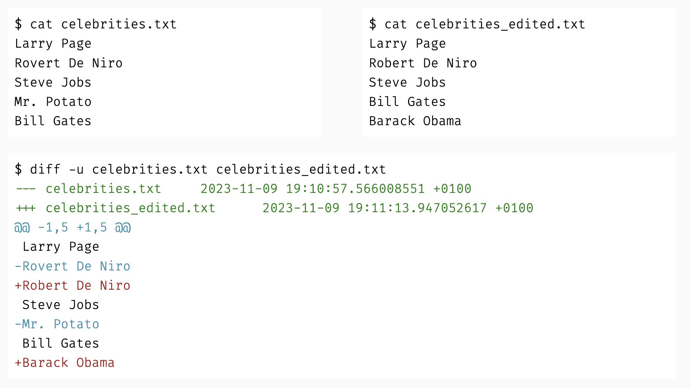
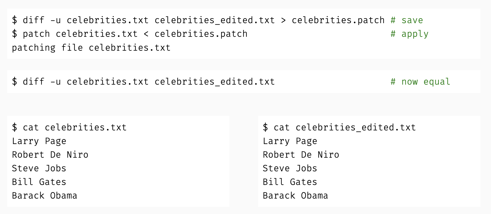
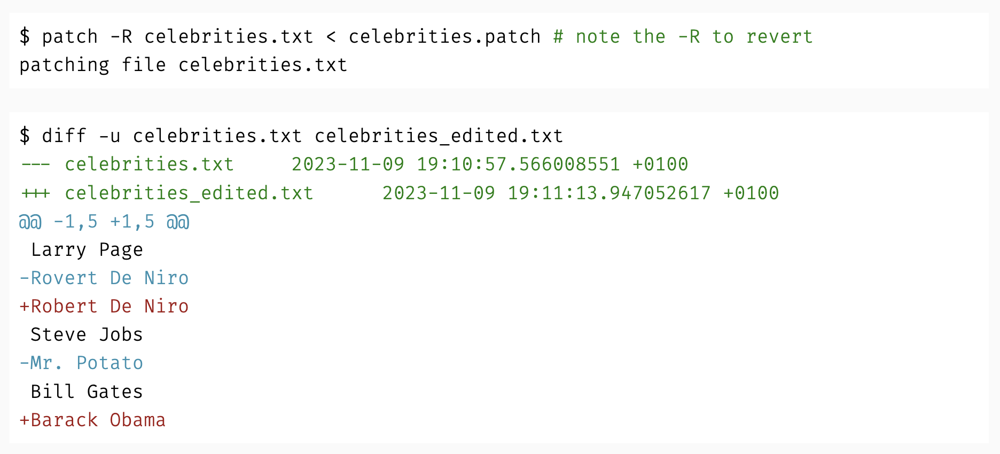

# Why version control?

-   Project evolution control

-   `git` as a *time machine*

-   Easy parallel collaboration

## Diff

The `diff` utility **compares** files **line by line.** This is very old, but this is still what git uses now. Git is a database that saves diffs during files.

The diff utility gives us the date we ran this file, and the additions and removals of the code.

## Patch

The `patch` utility **edits** a file given a set of `diff` **instructions**. 40% of git is diff, 40% is patch, and 20% is how it stores the data. Patch gives the instructions to the file and makes the changes.

the \> means save this diff into the desired file (in this case `celebrities.patch`). You run the diff, and then send it to someone and they patch it into their software.

It is clear and succinct what was changed.

Just as you can go *forward*, you can go **backwards**:

`-R` stands for reverse. This reverses the patch to get the previous file.
